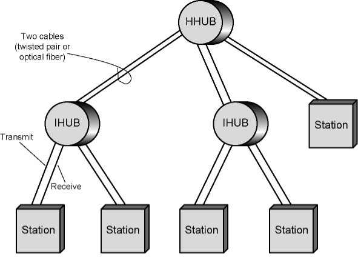

- Cable types that mainly used in [Ethernet](Ethernet.md)
## 10Base2
- **Cable Type**: Thin [Coaxial Cable](Coaxial%20Cable.md)
- **Topology**: [Bus Topology](Bus%20Topology.md)
- **Status**: Now obsolete
- **Characteristics**: 
	- Affordable
	- easy to install
	- limited in terms of data speed and segment length
## 10Base5
- **Cable Type**: Thick [Coaxial Cable](Coaxial%20Cable.md)
- **Topology**: [Bus Topology](Bus%20Topology.md)
- **Segment Length**: Maximum 500 meters per segment
- **Network Extension**: Up to 5 segments connected via repeaters, totaling a maximum of 2500 meters
- **Capacity**: Maximum 100 stations per segment
## 10BaseT
- The most commonly used 10 Mbps Ethernet option during its prime.
- **Cable Type**: Unshielded [Twisted Pair](Twisted%20Pair.md)(UTP)
- **Topology**: [Star Topology](Star%20Topology.md) and point-to-point cross cables
    - Stations are connected to a central hub or switch
	    -  Accepts input on one line and repeats it on all other lines
	    - Physical star layout but operates as a logical bus
    -  Two twisted pairs within  -> transmit and receive lines
- Collisions are still possible -> [Ethernet](Ethernet.md)(CSMA/CD) is employed for collision detection.
- **Distance Limitations**: Each link is limited to 100 meters
- **Network Expansion**:
    - Hubs or switches can be cascaded for larger network configurations
    - 
## 10BaseF
- **Cable Type**: [Optical Fiber](Optical%20Fiber.md)
- **Topology**: [Star Topology](Star%20Topology.md) or point-to-point
- **Considerations**: Often considered too expensive for 10 Mbps applications