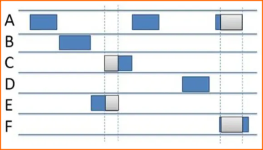
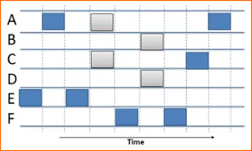

## ALOHA 
### Definition:
- Developed at the University of Hawaii in the early 1970s for wireless packet data networks.
- Packet Radio – Packet based wireless networking
- Underlying network protocol for development of [Ethernet](Ethernet.md)
- Applicable to any shared medium
### Properties: 
- When station has frame, it sends without checking if the channel is free
- Station listens for max round trip time
- If a collision occurs, each station waits for a random period of time before retransmitting
	- Collision is understood “by listening” or by “having no acknowledgement”
- Under heavy network load  -> high collision rates
	- Max channel utilization is 18%
	- very bad
	- not efficient and usable

## Slotted ALOHA
### Definition:
- Improved version of original ALOHA
- Underlying network protocol for development of [Ethernet](Ethernet.md)
- Divide the time into slots
### Properties:
- Equal to frame transmission time
- Need central clock (or other sync mechanism)
- Stations can only transmit at the beginning of a time slot
- If a node has a packet to send
	- sends it at the beginning of the next slot
- If collision occurred
	- retransmit at the next slot with a probability (random amount of time)
- Main objective is reducing the collisions with slotted design
- Max channel utilization is 37%
	- Still very bad

