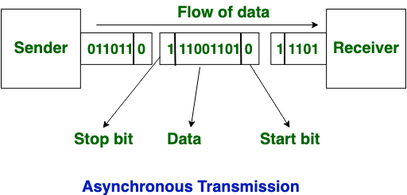

## Definition:
- One of the solution to synchronization problem in [Physical Layer](Physical%20Layer.md)
- Asynchronous transmission is characterized by its lack of need for a common clock signal and is suitable for intermittent data transfer

### Properties:
- **Data Transmission**: 
	- Sends one character at a time, generally 7-8 bits per character.
- **Prior Agreement**:
	- Parties must agree on 
		- the data rate
		- character length in bits 
	- No need to agree on starting and stopping time prior to communication
		- this information is exchanged during transmission
		- Extra overhead -> 1 bit for start + 1 bit for end
- Overhead can be 2, 3 or 4 bits
	- Min Overhead = 1 start bit + 1 stop bit
	- Max Overhead = 1 start bit + 2 stop bit + 1 pairty
- No common clock signal is needed
- High Latency due to processing time
	- Slow
- Errors are detected and corrected when data is received
	- Parity: can catch single bit errors
		- Odd: \# 1's odd
		- Even: \# 1's even
- Users do not have to wait for the completion of transmission in order to get a response from the server.
### Usage:
- Well-suited for scenarios where data is sent sporadically rather than in a continuous stream
	- Email
	- Forums
	- Letters
