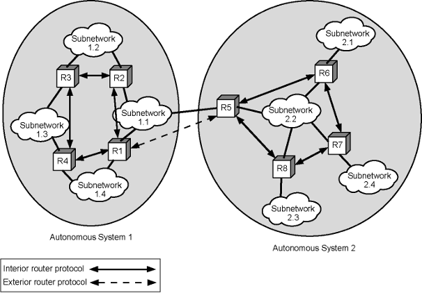
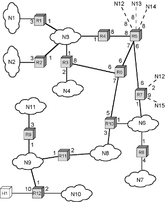

### Defintion:
- Collection of [IP](IP.md) networks and [Routers](Routers.md) 
	- Exchange [Routing](Routing.md)  information in itself
	- Common routing protocol
- Autonomous Systems must be connected in itself
	- there exist at least one routs connect two nodes to each other in network
- Under the control of a single entity (like ISP)
- Communication inside AS = [Interior Routing Protocols (IRP)](Interior%20Routing%20Protocols%20(IRP).md)
- Communication between AS = [Exterior Routing Protocols (ERP)](Exterior%20Routing%20Protocols%20(ERP).md)
- 
### Sample AS:
- For more diagrams about directed graph and spanning tree check the related slide
