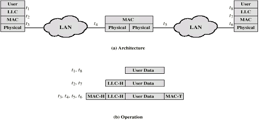
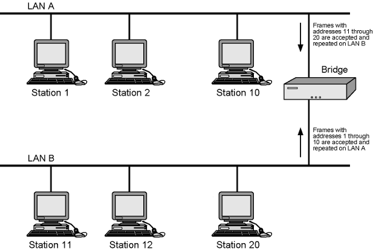

- One of the interconnection elements of [LAN](LAN.md)s
- **Definition**: 
	- Connect two or more network segments
	- Increasing the size of a LAN
	- Interconnection to other LANs and WANs
		- Connects similar LANs
		- Minimal Processing
	- Bridge is simpler than Router
- **Function:**
	- Read all frames transmitted on one LAN
	- Accept those addressed to any station on the other LAN
	- Retransmit each frame on second LAN
	- Do the same the other way round
- **Operation**:
	- Operate at the [Data Link Layer](Data%20Link%20Layer.md)
		- identical protocol for [Physical Layer](Physical%20Layer.md)
	- Filter traffic based on [Medium Access Control (MAC)](Medium%20Access%20Control%20(MAC).md) addresses
		- No need LLC layer
	- 
- **Design Aspects:**
	- No modification to content or format of frame
	- No additional header
	- Exact bitwise copy of frame from one LAN to another
		- reason for why two LANs must be identical
	- Has enough buffering to meet peak demand
	- May connect more than two LANs
	- Routing and addressing intelligence
		- Must know the addresses on each LAN to be able to tell which frames to pass
		- May be more than one bridge to reach the destination
	- Bridging is transparent to stations
		- All stations on multiple LANs think that they are on one single LAN
