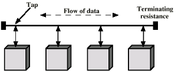

- A type of [LAN](LAN.md) Topology
- **Structure**: 
	- Stations are connected to a linear medium known as a bus
	- Stations connect via a tap, enabling both transmission and reception of data
- **Data Transmission**:
	- Data transmission propagates in both directions along the medium
	- All stations receive transmissions -> those not addressed ignore the data
- **Addressing**:
	- Each station has a unique address for identification
	- The destination address is included in the frame's header to direct data appropriately
- **Termination**:
	- Terminators are used at both ends of the bus to absorb frames and prevent signal reflection
- **Transmission Regulation**:
	- Implemented to prevent data collisions and to ensure equal access to the medium
	- **Collision Avoidance**:
		- If two stations transmit simultaneously, signal overlap occurs, leading to data corruption
	- **Fair Access**:
		- Continuous transmission by one station is prevented to avoid monopolizing the medium
	  - **Solution:**
		  - Data is transmitted in small blocks (frames) to manage network traffic and reduce collision risk
- 