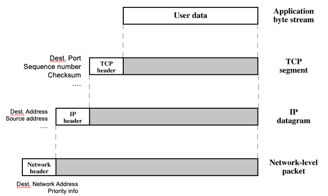
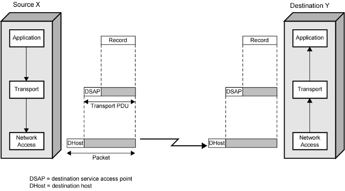
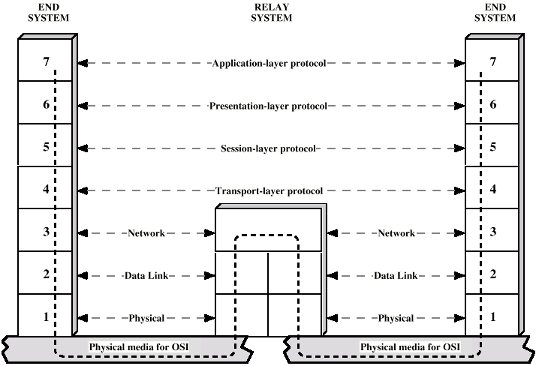
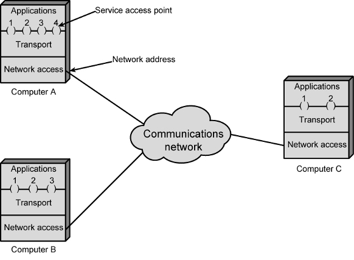
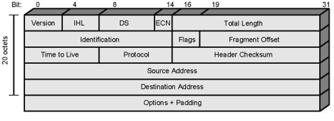
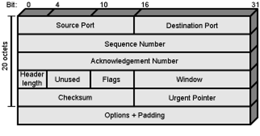
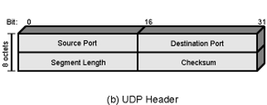
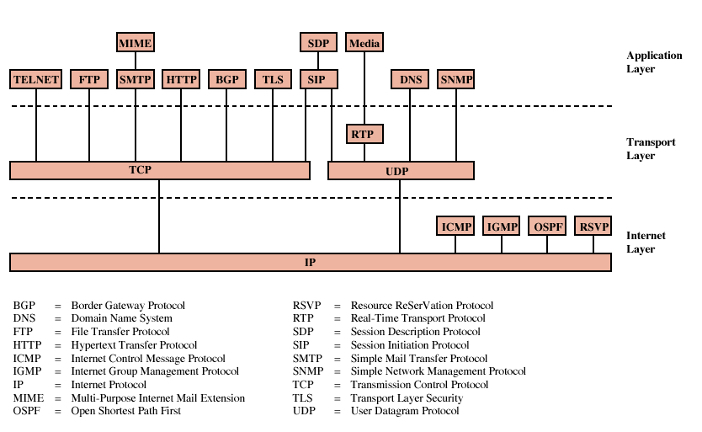
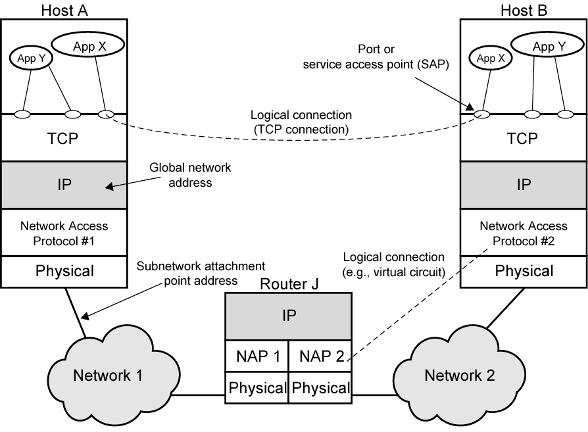
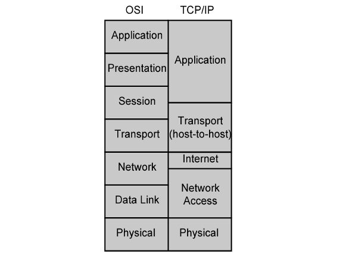

# CS408 - WEEK3

## Protocols

- **Meaning of Protocols**
    - set of rules and conventions that devices must follow to communicate with each other
    - Proper Communication: 
        - entities in d,ifferent systems must speak the same language 
        - cooperative action is necessary
- **Principles of Protocols:****
    - Each layer provides services to upper layer; expect services from lower one
    - peer-to-peer protocols = each layer is independent
        - change in one protocol should not affect the other protocols
- **Architecture of Protocols**
    - **TCP/IP Model**
        - *Network Access (Internet) Layer*
            - Purpose: Exchange of data between the computer and the network
            - Techniques:
                - Circut Switching
                - Packet Switching
                - LANs
            - PDU (Packets) add network header
                - Sending computer provides address of destination
                - So network can route
            - Key Protocol: 
                - *Internet Protocol (IP)*
                    - Manages packet addressing and routing.
        - *Transport Layer*
            - Purpose: Ensures end-to-end communication and data integrity.
            - Independent of 
                - network being used
                - application
            - *Ports:*
                - Number of ports is give the uniqeness to layer
                -  Allow multiple services to share and operate on a single server efficiently
            - *Protocol DAta Units (PDU)*
                - a.k.a *Packets*
                - Data + Header + Trailer = PDU
                - User Data is passed layer to layer
                - During transport data may fragmented --\> each fragmnet has
                    - Control info. is added/removed in each layer transaction
                        - each layer has different header/trailer = each layer has different PDU
                        - Control info:
                            - Destination Port
                            - Sequence number
                            - Error Detection Code
                - 
            - Key Protocols:
                - *Transmission Control Protocol (TCP)*
                    - Ensures reliable and ordered data delivery.
                - *User Datagram Protocol (UDP)*
                    - Provides connectionless communication without guaranteeing delivery order.
        - *Application Layer*
            - Purpose: Provides network services directly to user applications.
            - Key Protocols: HTTP, SMTP, FTP, and more.
        - 
    - **Open System Interconnection (OSI) Model**
        - Properties:
            - Never used widely, no protocol survived using OSI model
                - delivired too late
            - Developed by International Oraganization for Standartization
            - Each layer 
                - relies on the next lower layer to peform more primitive functions
                - provides service to next higher layer
            - changes in one layer should not require changes in other layers
        - *Physical Layer*: Deals with the physical medium, signaling, and connection.
        - *Data Link Layer*: Ensures error-free transmission between neighboring devices.
        - *Network Layer*: Manages data routing and packet forwarding.
        - *Transport Layer*: Ensures end-to-end data transfer and integrity.
            - SAP (Service Access Points)
                - unique identifier used to distinguish a particular communication endpoint in a networked device
        - *Session Layer*: Manages sessions or connections between applications.
        - *Presentation Layer*: Translates data formats and ensures data integrity.
        - *Application Layer*: Delivers application services to users.
        - 
    - **Addressing Requirments**
        - Two Level Addressing
            - Each Computer
                - unique network address
                - Each Application
                    - unique address within the computer
                        - SAP
                        - Port
            - 
    - **TCP/IP Protocol Suite**
        - Most widely used
            - used bu Internet and WWW
            - Founded by DARPA for its packet switched network ARPANET
        - Dont have offical layer structure
            - TCP/IP reference model has been bulit on its protocols
        - network acces and physical layer is most in hardware
            - ex: ethernet
            - these not defined bu TCP/IP protocol
        - *IP (Internet Protocol)*
            - Core of TCP/IP protocol suite
            - IPv4: 
                - Uses a 32-bit addressing scheme. 
                - Most commonly used.
                - 
            - IPv6: 
                - Uses a 128-bit addressing scheme. 
                - Newer and offers more addresses.
                - Not backwart compatible
        - *TCP (Transmission Control Protocol)*: 
            - Connection-oriented protocol ensuring data is sent and received reliably.
            - 
        - *UDP (User Datagram Protocol)*: 
            - Connectionless protocol for faster, but possibly unordered, data transfer.
            - end-to end protocol
            - not guaranteed delivery
            - no preservation of equence
            - no protection against duplication
            - minimum overhead (fast)
            - 
        - Example Protocols:
            - 
        - Operation of TCP/IP
            - 
        - OSI vs TCP/IP
            - 
    - **Internetworking**
        - Definition: The practice of connecting multiple networks together using gateways, bridges, and routers.
        - Subnetwork: each constituent of network
        - Internet: Entire configiration
            - the Internet is the mos timportant example of an internet
        - Devices:
            - *End Systems (ESs)*: 
                - Devices at the edge of the network
                - e.g., computers and smartphones.
            - *Intermediate Systems (ISs)*: 
                - *Routers*:
                    -  Devices that forward data packets between networks.

## Standards and Organizations

- Standards ensure interoperability among devices and software from different vendors.
- Key organizations:
    - **Internet Society (ISOC)**: 
        - Supports and promotes the development of the internet.
        - *IAB (Internet Architecture Board)*
            - overall Internet architecture
        - *IETF (Internet Engineering Task Force)*
            - protocol engineering and development
        - *IESG (Internet Engineering Steering Group)*
            - monitors IETF standardization efforts
    - **ISO (International Organization for Standardization)**:
        - Develops and publishes international standards.
        - more formal
        - NGO (non-govemental oranization)
            - But members are from governments
    - **ITU (International Telecommunications Union)**: 
        - UN specialized agency for information and communication technologies.
        - Govermental
- **Internet Drafts and RFCs**
    - *Internet Draft*: 
        - A working document with the potential of becoming an Internet standard
        - expires in 6 months if IESG does not approve it as an RFC
        - can be resubmitted
        - published online
        - comments are welcome
    - *RFC (Request for Comments)*: 
        - A published specification for networking protocols and systems.
        - final version
        - can be any type of documnet
- **Internet Standards Track**
    - Step1: Internet Draft
    - Step2: Proposed Standard
        - Internet Draft approved as an RFC by IESG
        - must remain at least six months to advance 
        - at least two independent and interoperable implementations 
    - Step3: Draft Standard
        - must remain at least 4 months
        - Significant operational experience
            - key difference between ISOC and other standardization organizations 
        - Consensus needed
    - Step4: Internet Standard
- **Internet Assigned Numbers Authority (IANA)**: 
    - An ISOC entitiy
    - responsiple from unique numbers
    - Manages global IP address allocation and other internet protocol resources.

