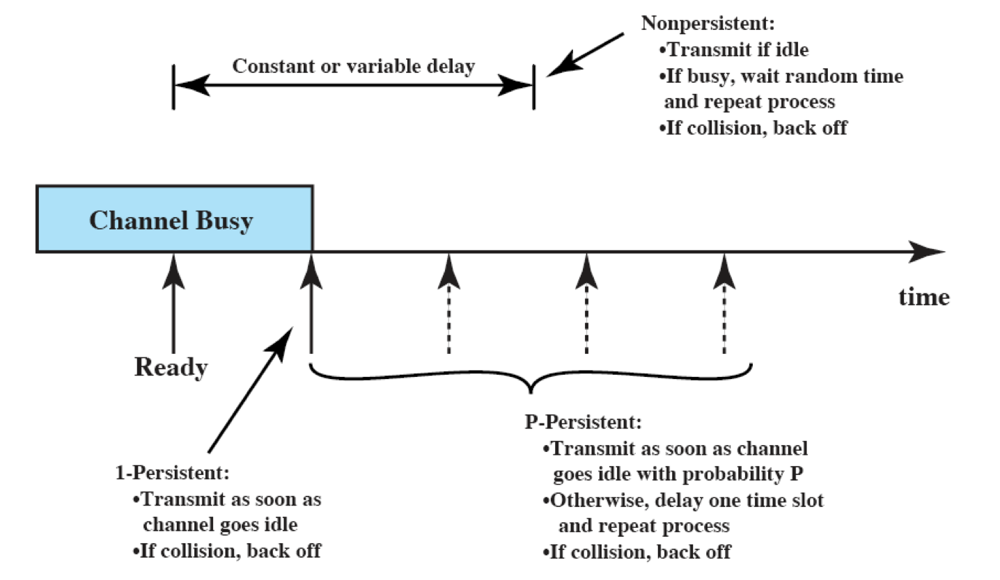

## Carrier Sense Multiple Access (CSMA)
- Fundamental Idea that leads to development of [Ethernet](Ethernet.md)(CSMA/CD)
- Collision occupies medium for duration of transmission
	- It is inefficient to complete the transmission of a collided packet
## Types:
### 1-Persistent CSMA
- **Definition:**
	-  Continuously senses the channel and transmits immediately when the channel becomes free
	- Has a higher chance of collisions, especially in busy networks
	- Utilization better than [ALOHA](ALOHA.md)
- **Operation:**
	- First listen for clear medium (carrier sense)
	- If channel idle -> transmit
	- If channel busy -> continuously check the channel until it is idle -> transmit
	- If collision occurs
		- Wait random time and retransmit (basic backoff)
		- Collision probability depends on the propagation delay
		- Longer propagation delay = worse the utilization
			- Collision may occur even if the propagation time is zero
			- Since multiple stations attempting to transmit simultaneously as soon as the medium becomes available
### Non-Persistent CSMA
- **Definition:**
	- Waits a random period of time if the medium is busy and then rechecks
	- Balance between -> collision avoidance & channel utilization
	- Better utilization, longer delay
- **Operation:**
	- If channel idle -> transmit
	- If channel busy -> do not continuously seize the channel
		- wait a random period of time and sense the channel again
	- If collision occurs
		- Wait random time and retransmit (basic backoff)
		- Collision probability depends on the propagation delay
		- Longer propagation delay = worse the utilization
### p-Persistent CSMA
- **Defintion:**
	- Used in slotted channels like in the [Slotted ALOHA](ALOHA.md#Slotted%20ALOHA) 
	- Aims to reduce collisions by not always transmitting immediately in a free slot
- **Operation:**
	- When channel idle (free)
		- transmits with a probability p
		- defer until the next slot with probability 1 – p
		- repeat this algorithm until it sends or channel becomes busy by another station
	- When channel busy -> checks the next slot waits for the next slot with a probability 1-p
	- If collision occurs ->wait a random period of time(basic backoff) -> repeat the same algorithm
	- Larger p -> smaller utilization + smaller waiting time for the packets
### [Ethernet](Ethernet.md)
## All persistence Schemes:

