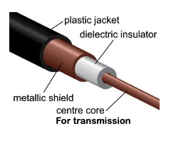

### Definition:
- One of the types of [Guided Media](Guided%20Media.md)
- Used in telecommunications and networking, consisting of a central conductor, an insulating layer, a metallic shield, and an outer insulating layer.
- Detailed information about [Coaxial Cable](https://www.geeksforgeeks.org/what-is-coaxial-cable/?ref=lbp)
- 

### Properties:
- Most versatile medium
- Can carry 10,000 voice calls simultaneously
- Mostly replaced by fiber optic
- **Signal Transmission**:
	- Carries both analog and digital signals, including high-frequency transmissions.
### Usage:
- Television distribution
- Aerial antenna to TV
- Cable TV
- Long distance telephone transmission
- Cable Internet
- Local area networks([LAN](LAN.md)) (old technology)
	- Mostly replaced by Twisted pair or Optical Fiber Cable
	- Important since: all parameters written based on Coaxial Cable structure
### Pros & Cons:
- **Pros:** 
	- Less Vulnerable to Interference than twisted pair
		- due to concentric structure
		- Protection form EMI and RFI
	- High Bandwidth Capacity
	- Durable and suitable for both indoor and outdoor installations.
- **Cons:** 
- Periodic amplifiers/repeaters needed 
	- Over long distances, signal degradation requires the use of amplifiers or repeaters.
- Less flexible than twisted pair
- More Expansive than twisted pair
