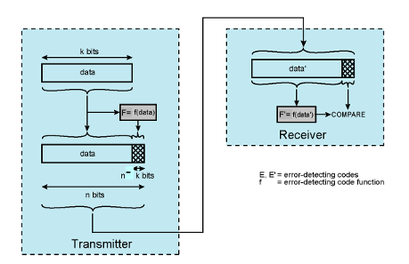
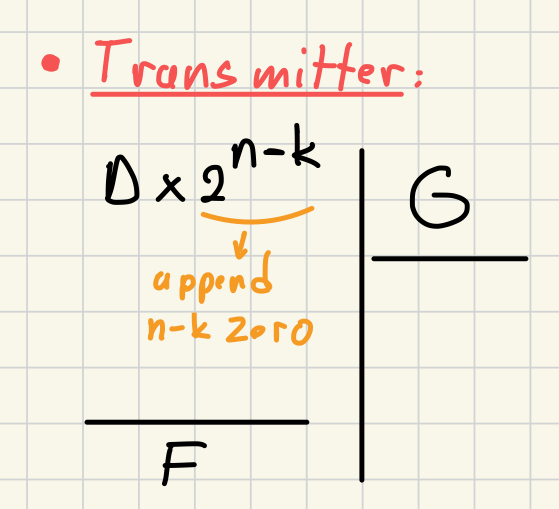
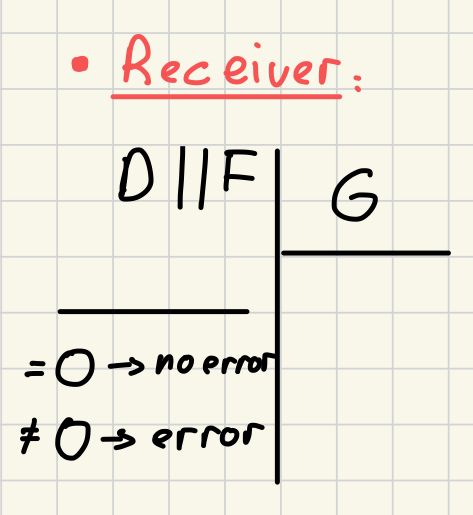

### Defintion:
- Type of error-detecting code commonly used [Data Link Control Layer](Data%20Link%20Control%20Layer.md)
- It uses binary division operation for detecting errors

### Operation:
- D -> k bit data block
- F -> n-k bit frame check sequence (FCS)
- G -> n-k+1 bit
	- most and least significant bits are 1
	- they are standard  and pre generated 
- Transmitter:
	- 
- Receiver:
	- 
	- **Error Checking**: 
		- If the remainder is zero -> error-free
		- If reminder is not zero -> error
### Effectiveness:
  - CRC can detect all single, double, and odd number of errors.
  - It can catch burst errors of a length less or equal to the FCS size.
  - It can detect most burst errors longer than the FCS size with good probability
	  - burst = generator length (n-k+1) => P(undetected) = $\large 1/2^{n-k-1}$
	  - burst > generator length (n-k+1) => P(undetected) = $\large 1/2^{n-k}$