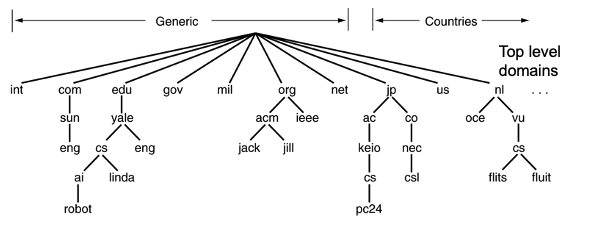
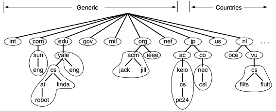
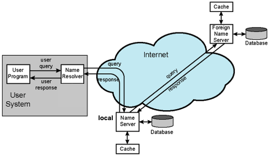

## Internet Directory Services DNS

### Definition
- A critical directory lookup service for the internet
	- Must for [The Internet](The%20Internet.md)
- Mapping hostnames to IP addresses
	- Turn IP addresses to user friendly domain names
- Defined in RFC 1034 (concepts)
- RFC 1035 (implementation)
- DNS operates at the [Application Layer](Application%20Layer.md).
- Uses mainly [IP (Internet Protocol)](TCP-IP%20Protocol.md#IP%20(Internet%20Protocol)) and [UDP](UDP.md) connection
- A Typical [DNS Operation](DNS%20Operation.md) can be seen here
### Structure
- **Domain Name Space**:
	- A hierarchical, tree-structured database.
	- **Domain Name**:
		- Separated by (".")
		- **IPv4 Addresses**: 
			- 32-bit numbers identifying devices
			- Components: network and host (or subnet)
		- **Human-Friendly Names**: 
			- Domains provide a user-friendly naming mechanism 
			- Hierarchical structure because of organizational or geographic boundaries
	- **Domain Tree**:
		- over 200 TLDs (Top Level Domains)
		- Naming follows organizational boundaries -> not physical boundaries
		- Labels at most = 63 char
		- Full name at most = 255 char
		- Case intensive
		
- **DNS Database**: 
	- Distributed, containing resource records ([Resource Record (RR)](Resource%20Record%20(RR).md)s) for each domain.
	- Organized into zones, each managed independently with its own name server.
	- **Zones**:
		- Each non-leaf node may or may not manage its child
		
- **Name Servers**: 
	- Servers that hold part of the DNS database relevant to certain domains.
	- Server for TLDS
	- Local Server starts with a root server if it does not know anything about to domain to be resolved
	- **Authoritative Servers**: 
		- Maintain official records for their designated zones, with secondary servers caching data for redundancy and performance.
		- The authoritative name server of a host is the one that keeps the A type RR of that host
		- Local name server  = authoritative name server for all of the hosts in its zone
- **Name Resolvers**: 
	- Client-side applications that retrieve domain information from name servers.
	
