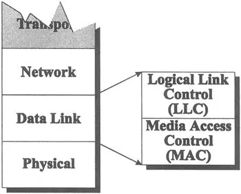

#NotFinished 
### Definition:
- The Data Link Layer is the second layer in the [OSI Model](OSI%20Model.md) (Open Systems Interconnection) model.
- It establishes, maintains, and terminates a logical link between nodes on a network
- Deal with issues related to point to point links
- Ensures reliable and efficient communication over the physical layer by structuring raw data into frames and handling error detection and correction
## Properties:
-  **Frame Structuring**:    
	- Transforms raw data from the [Physical Layer](Physical%20Layer.md) into frames
	- Add headers and trailers for synchronization and error checking
	- Detect and correct errors that occurred during transmission
	- Adds [Medium Access Control (MAC)](Medium%20Access%20Control%20(MAC).md) addresses to frames
		- Identify the source and destination devices on a local network
- **Flow Control**: 
	- Manages the pace at which data is sent to prevent a fast sender from overwhelming a slow receiver. 
	- Two ways to prevent buffer overflow:
		- [Stop and Wait](Stop%20and%20Wait.md)
		- [Sliding Window](Sliding%20Window.md)
- **Error Detection and Control:**
	- Detect and if possible correct the errors  occurred  during  transmission frames.
	- Adopt flow control algorithms such that erroneous frames are retransmitted.
	- **Types of Errors:**
		- Single Bit Errors:
			- ------explanation------
		- Burst Errors:
			- ------explanation------
	- **Error Detection:**
		- Parity  Bits:
			- ------explanation------
		- [Cyclic Redundancy Check (CRC)](Cyclic%20Redundancy%20Check%20(CRC).md)
	- **Error Control:**
		- [Stop and Wait ARQ](Stop%20and%20Wait%20ARQ.md)
		- [Go-Back-N ARQ](Go-Back-N%20ARQ.md)
		- [Selective Reject ARQ](Selective%20Reject%20ARQ.md)
- **Protocols:**
	- [[High Level Data Link Control (HDLC)]]
	- **LAPB:**
		- ------explanation------
	- **LAPD:**
		- ------explanation------
	- **[Logical Link Control (LLC)](Logical%20Link%20Control%20(LLC).md)**:
		- Operates as a sublayer within the Data Link Layer
		- Plays a pivotal role in ensuring effective communication within [LAN](LAN.md)s.
		- Provides an interface between the Network Layer and the MAC sublayer.
