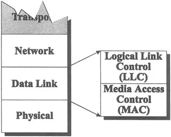

#NotFinished 
### Definition:
- The Data Link Layer is the second layer in the [OSI](OSI.md) (Open Systems Interconnection) model.
- It establishes, maintains, and terminates a logical link between nodes on a network
- Ensures reliable and efficient communication over the physical layer by structuring raw data into frames and handling error detection and correction
## Properties:
- This layer plays a pivotal role in ensuring effective communication within [LAN](LAN.md)s.
-  **Frame Structuring**:    
	- Transforms raw data from the [Physical Layer](Physical%20Layer.md) into frames
	- Add headers and trailers for synchronization and error checking
- Detect and correct errors that occurred during transmission
- Adds [Media Access Control (MAC)](Media%20Access%20Control%20(MAC).md) addresses to frames
	- Identify the source and destination devices on a local network
- **Flow Control**: 
	- Manages the pace at which data is sent to prevent a fast sender from overwhelming a slow receiver. 
- **Access Control**: 
	- When multiple devices share the same physical medium, the Data Link Layer determines which device has control over it at any given time.
- **Link Management**: 
	- Responsible for establishing, maintaining, and terminating links between network devices.
- **[Logical Link Control (LLC)](Logical%20Link%20Control%20(LLC).md)**:
	- Operates as a sublayer within the Data Link Layer
	- Provides an interface between the Network Layer and the MAC sublayer.
