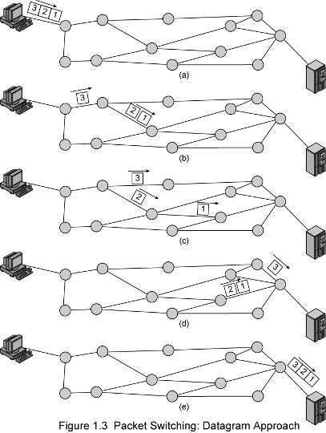

## Datagram Approach
- One of the type of [Packet Switching](Packet%20Switching.md) approaches
- **Pros**
    - Each packet tread as individually
    - Packets can take practical route
    - Better if few packets
    - More reliable, more flexible
        - In case of node failure, alternative routes can be found
        - routing can be used o avoid congested parts of network
        - Become idealized more used than Virtual Circuit Approach
- **Cons**
    - Packets may arrive out of order
    - Packets may may go missing 
    - Receiver is responsible to reorder and retrieve  missing packets

