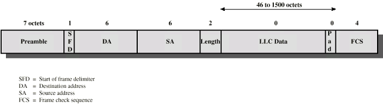
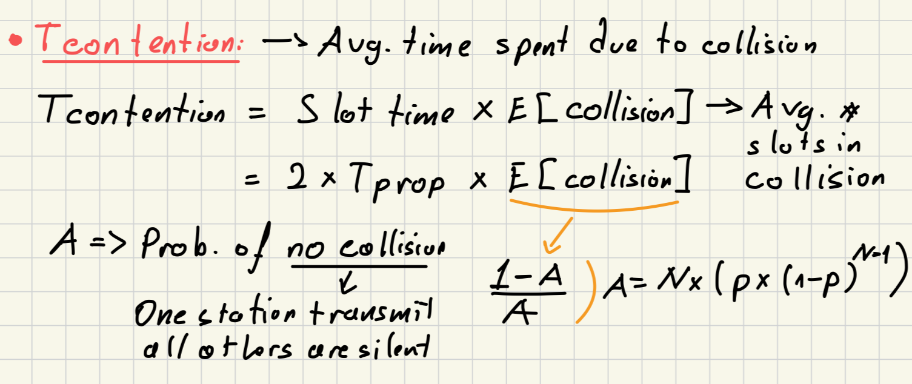

## Ethernet (CSMA/CD)

### Definition
- **Ethernet**:
	- Widely-used technology for local area networks ([LAN](LAN.md)s), based on the CSMA/CD protocol.
	- Two faster version: [Fast Ethernet](Fast%20Ethernet.md) and [Gigabit Ethernet](Gigabit%20Ethernet.md)
- **CSMA/CD (Carrier Sense Multiple Access with Collision Detection)**: 
	- A network access method used in Ethernet to manage how devices on the network share the communication medium.
	- Based on [CSMA](CSMA.md) + Collision Detection
	- Underlying protocol for [Medium Access Control (MAC)](Medium%20Access%20Control%20(MAC).md)
### Properties (CSMA/CD):
- Slotted System
	- contention slot = 2 x Tprop
	- one slot time = max. round trip delay = 50 microseconds in 10 Mbps
- No acknowledgement -> sending station must ensure:
	- all other stations are aware of its transmission
	- there is no collision on the channel
- So the sending station has to continue transmission as long as the round trip time
	- In worst case scenario of understanding collusion = round trip time
	- Related to cable length + propagation speed
	- 2500 meters of [Coaxial Cable](Coaxial%20Cable.md)(standard for 10 Mbps Ethernet)
		- RTT = approx. 50 microseconds
		- [10Mbps Medium Options](10Mbps%20Medium%20Options.md)
### CSMA/CD (IEEE 802.3 – Ethernet)
- Design based on implementation of [Contention Method](Asynchronous%20(dynamic)%20Solutions.md#Contention%20Method) with [ALOHA](ALOHA.md) + [CSMA](CSMA.md)
- Minimum frame size is set to 512 bits (64 bytes)
- Frame Format:
	- Preamble = clock sync -> not part of the data  
	- SFD = 10101011
	- DA + SA = [Medium Access Control (MAC)](Medium%20Access%20Control%20(MAC).md) -> unique to prevent sending wrong adrress
	- Length of the LLC Data
	- [Logical Link Control (LLC)](Logical%20Link%20Control%20(LLC).md) data
	- FCS = 32 bit CRC (Cyclic Redundancy Check) code and excludes Preamble and SFD

- **Operation:**
	- As in 1-persistent CSMA, but uses slotted channels
	- If medium idle -> transmit
	- If busy -> listen for idle slot -> transmit
	- Stations listen while transmitting (different form CSMA)
		- If collision detected (due to high voltage on bus) -> cease transmission and wait random time then start again
			- Random waiting time is determined using [Binary Exponential Backoff](Binary%20Exponential%20Backoff.md) mechanism
### Performance:
- Formulation for utilization
- Utilization = Ttrans / (Ttrans + All other)
	- No collisions  -> U = Ttrans / (Ttrans + Tprop)
	- With collisions  ->  = Ttrans / (Ttrans + Tprop + Tcontention)
	- Tcontention is the time spent for collisions to send a frame

