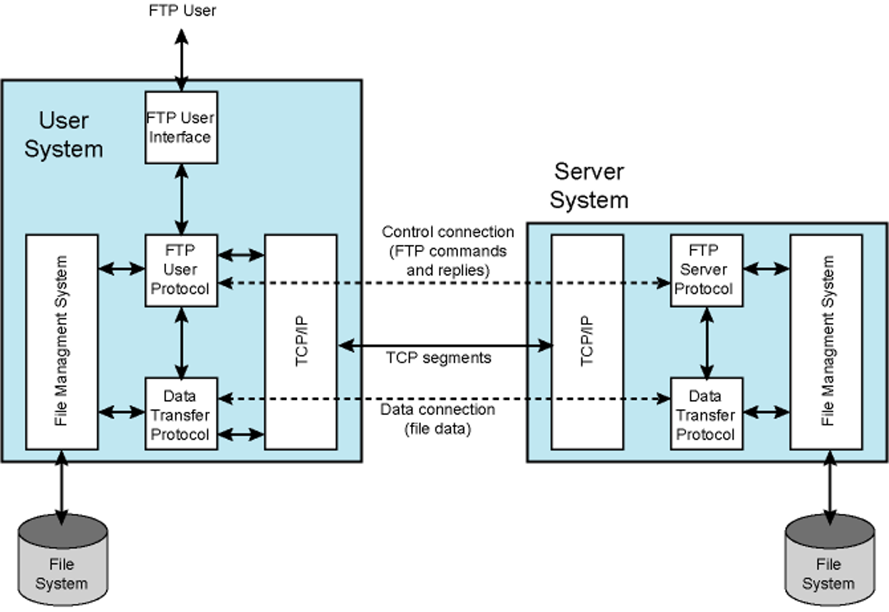

## File Transfer Protocol (FTP)

### Historical Context: 
- Old protocol contemporary to [Telnet](Telnet.md)
	- Most of the commands still in use
  - Defined in RFC 959
- Manages file systems
	- Not just individual files 
		- file pathnames
		- directory listing
		- access control
### Properties:
 - FTP operates at the [Application Layer](Application%20Layer.md).
- FTP Model is consist of: 
	- User FTP (Host) -> send request
	- Server FTP entities -> always reply
- Uses [TCP/IP](TCP/IP) on port 21
	- Server FTP always listen port 21
	- Utilizes two TCP connections: 
		- one for control information
		- another for data transfer
### Phases of Operation:
1.  User FTP initiate connection to Server FTP by using port 21 
	- First sends username and password to identify him/herself
2. Server FTP Authenticate  User FTP via username and password
	- Accept
		3. User FTP send request
		4. Server FTP transfer the data 
	- Reject
		- Terminate the connection

### FTP Commands
  - **Access Control**: 
	  - Username = USER
	  - Password = PASS
  - **Data Connection Parameters**: 
	  - Data port = PORT 
		  - Active Mode 
		  - User FTP listens the port
		  - Server FTP is active
			  - initiates data connection and data transfer
	  - Passive Mode = PASV 
		  - Passive Mode
		  - Server FTP is passive (listens port)
		  - User FTP access port and initiate connection
	  - [How FTP works](https://web.archive.org/web/20090214233255/www.freefire.org/articles/ftpexample.php)
  - **File System Operations**: 
	  - Store = STOR
	  - Retrieve = RETR
	  - Append = APPE
	  - Delete = DELE
  - **Directory Actions**: 
	  - Change Directory = CWD
	  - Make Directory = MKD
	  - Print Current Directory = PWD 
	  - Directory Listing = LIST
		  - Data connection is needed
### Options:
  - FTP assumes files have names, owners, and specific access permissions
  - Negotiates options for data/representation type, file type, and transfer mode
  - **Data/representation Types:**
	  - Primary types
		  - ASCII
			  - Text files stored as character string (8-bit ASCII)
		  -  Image (binary)
			  -  Image transfer is bit-by-bit
	  - Change type with TYPE command (A for ASCII, I for Image)
- **File Types:**
	- Represented during transfer as file, record, or page structures
	- Only file structure supported by FTP server and users commonly
	- Change file structure  = STRU
		- F for File structure
		- R for Record structure
		- P for Page structure
- **Transmission Modes:**
	- Stream Mode: 
		- Default
		- Sends raw data with minimal processing
	- Block Mode: 
		- Obsolete
		- Allows restarting interrupted transfers
	- Compressed Mode: 
		- Obsolete
		- Simple data compression
	- Setting transmission mode:
		-  S for Stream mode
		- B for Block mode
		- C for Compressed mode