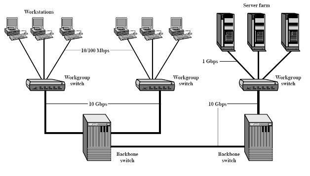
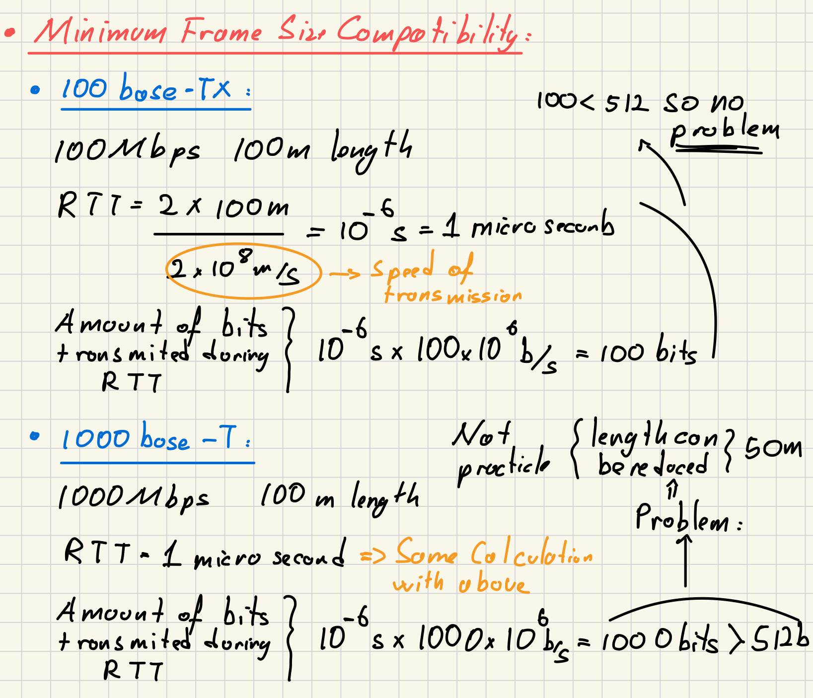

- Same message format as 10 Mbps [Ethernet](Ethernet.md) and[Fast Ethernet](Fast%20Ethernet.md)
	- due to backward compatibility
- Why wee need it ?
	- 10/100 Mbps load from end users creates increased traffic on backbones
	- So its good for backbones
	- 10Gbps Ethernet also created because of backbone issue
		- Also it can used to create MANs (Metropolitan Area Networks)
- **Speed**: 1 Gbps = 1000Mbps
- Use Mainly [Optical Fiber](Optical%20Fiber.md) cable:
	- •1000Base-SX
		- Short wavelength, multimode fiber
	- 1000Base-LX
		- Long wavelength, Multi or single mode fiber
	- 1000Base-CX
		- A special STP (<25m)
		- one for each direction
	- 1000Base-T
		- 4 pairs, cat5 UTP (bidirectional)
		- 100 m

- **Minimum Frame Size Compatibility**: 
	- Gigabit Ethernet maintains the minimum frame size of 64 bytes to be compatible with earlier Ethernet standards, despite the increase in speed. 
		- if we calculate it similar to Ethernet it transmit 1000 bits in RTT > 512bits (standard ) 
		- Solution  -> reduce segment to 50 m (not practical)
	- Practical Solutions:
		- Carrier extension
			- Sending hardware adds more padding, receiving hardware removes. Thus the standard Ethernet frame remains the same
			- Not good for efficiency due to extra padding overhead
		- Frame bursting
			- Sender concatenates several frames
			- If needed hardware adds more padding

