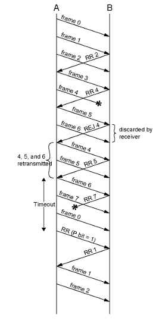

### Definition:
- A type of ARQ used in [Data Link Control Layer](Data%20Link%20Control%20Layer.md) for error control.
- Based on [Sliding Window](Sliding%20Window.md)
- Sender uses window to control the number of unacknowledged frames
- Sender Window size = buffer size -> $2^n-1$
- Receiver do not need buffer -> window size = 1
### Operation:
- If no error -> ACK with next frame expected
	- Cumulative Acknowledgement
		- ACKi means 
			- "I am ready to receive frame i" and "I received all frames between i (not included) and my previous ack"
			- since we have cumulative ack even there are lost frames in between if next frame is accepted there is no problem
- If error -> receiver reply with rejection (negative ack)
	- Discard that frame and all future frames until the frame in error is received correctly
	- Transmitter must go back and retransmit that frame and all subsequent frames
	- **Damaged Frame:**
		- Receiver detects error in frame i
		- Receiver sends “reject i”
			- if reject is damaged and cant be transmit
				-  transmitter asks the receiver ack for the last frame received
				- then continue by retransmitting next frame
		- Transmitter gets “reject i”
		- Transmitter retransmits frame i and all subsequent frames
	- **Lost Frame:**
		- Case1:
			- Frame i  lost
			- Transmitter sends frame i +1
			- Receiver gets frame i +1 out of sequence
			- Receiver sends “reject i”
			- Transmitter goes back to frame i and retransmits it and all subsequent frames
		- Case2:
			- Frame i lost and no additional frame sent
			- Receiver gets nothing and returns neither acknowledgment nor rejection
			- Transmitter times out and sends acknowledgment frame with P bit set to 1 (
				- command for ack request 
			- Receiver interprets this as an ack request command which it acknowledges with the number of the next frame it expects i
			- Transmitter then retransmits frame i
### Example:
- k = 3 i.e. frame numbering is modulo 8
- Last RR in this example ACK request
- 