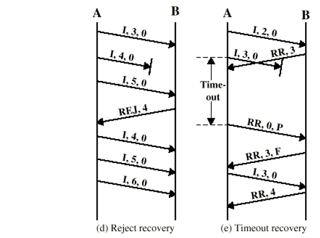

### Definition:
- A type of protocol used in [Data Link Control Layer](Data%20Link%20Control%20Layer.md)
- ISO standart
- No longer used but basis of other DLL protocol
### Station Types:
- **Primary station:**
	- Control link operation
	- Issued frames -> commands
- **Secondary station:**
	- Under the control of primary station
	- Issued frames -> responses
- **Combined station:**
	- Can issue bot commands and responses
### Link Configuration:
- **Unbalanced:**
	- One primary + one or more secondary stations
	- Support -> full and half duplex
- **Balanced:**
	- Rwo combined stations
	- Support -> full and half duplex
### Transfer Modes:
- **Normal Response Mode (NRM):**
	- Unbalanced configuration
	- Primary station initiates transfer to secondary station
	- Secondary may only transmit data in response to command from primary
	- Terminal-Host communication
		- Host -> primary station
		- Terminal -> secondary station
	- Not commonly used
- **Asynchronous Balanced Mode (ABM):**
	- Balanced configuration
	- Both sides can initiate communication without receiving permission
		- peer to peer
	- Most widely used
### Frame Types:
- **Information Frame:** (I - Frames)
	- Transmit data to user
	- ACK is piggybacked -> only for positive ack
	- P/F bit is used to manage the flow of frames between the sender and receiver
- **Supervisory Frame:** (S - Frames)
	- Used For ARQ messages
	- Types: RR (Receive Ready), RNR (Receive Not Ready), REJ (Reject), and SREJ (Selective Reject)
		- Only RR can be piggybacked other should be send by supervisory frame
	- P/F bit is used to manage the flow of frames between the sender and receiver
- **Unnumbered Frame:**
	- Supplementary link control functions
		- Setting the modes
		- Disconnect
	- P/F bit can be used in both commands and responses
### Frame Structure:
- All transmissions in frames
- Single frame format for all data and control exchanges

- **Flag Fields:**
	- Special sequence to identify start and end = 01111110
	- Receiver search for this flag for synchronization
	- Bit stuffing:
		- used to prevent confusion if data contain flag sequence
		- insert 0 -> after every sequence of five 1's
		- if receiver detects five 1s after a 0 it checks next bit
			- If 0 -> it is deleted
			- If 1 and seventh bit is 0 -> accept as flag
		- If sixth and seventh bits 1 -> sender abort
			- data cannot have consecutive seven 1s
		
- **Address Field:**
	- identifies whether secondary station will receive or send a frame
	- 8 bit long (7 bit effective)
		- leftmost bit of each octet indicates that it is the last octet (1) or not (0)
		
	- may be extend to multiples of 7 bits
- **Control Field:**
	- Control field is different for each type of frame
	
	- Poll/Final Bit
		- Poll Bit (P-bit): 
			- When set by the sender, it indicates a request for a response from the receiver
			- used in commands ( P-bit set to 1)
		- Final Bit (F-bit): 
			- When set by the receiver, it indicates a response or acknowledgment to the sender's poll
			- used in responses (F-bit set to 1)
- **Information Field:**
	- Found only in Information frames and some Unnumbered frames
	- Must contain an integral number of octets (1 byte = 8 bit)
	- The length of the Information field is variable
		- allow flexibility in data transmission size
- **FCS Filed:**
	- Frame Check Sequence Field
	- Error Detection
	- 16 bit [Cyclic Redundancy Check (CRC)](Cyclic%20Redundancy%20Check%20(CRC).md)
	- optionally 32 bit CRC can be also used
### Operation:
- **Initialization:**
	- Establishes a data link between two nodes
	- Issue one of six set-mode commands
		- Signals other side that initialization is requested
		- Specifies mode (NRM, ABM)
		- Specifies 3 or 7-bit sequence numbers
	- If request accepted -> "unnumbered acknowledged" (UA) frame sent
	- If request rejected -> "disconnected mode" (DM) sent
	- All sent as unnumbered frames
- **Data Transfer:**
	- User data is transmitted by both sides using Information frames (I-frames)
		- N(S): Sequence number of outgoing I-frames
			- modulo 8 or 128 (3-bit or 7-bit )
	- N(R): Acknowledgment number in received I-frames
		- indicating the sequence number of the next expected I-frame
	- Supervisory frames (S-frames) are used for both flow and error control:
		- Receive Ready (RR): 
			- acknowledges the receipt of the last I-frame
			- indicates the expectation for the next I-frame
			- used when there's no data to be sent in reverse
		- Receive Not Ready (RNR): 
			- acknowledges receipt of I-frames
			- signals the sender to pause sending further I-frames
			- once ready, an RR is sent to resume the flow
		- Reject (REJ): 
			- initiates the [Go-Back-N ARQ](Go-Back-N%20ARQ.md) protocol
			- indicates last I-frame received has been rejected
			- retransmission is requested beginning with this sequence number
		- Selective Reject (SREJ): 
			- requests the retransmission of a specific I-frame 
			- without going back to the last acknowledged frame
			- targeting a single frame error recovery
- **Disconnect:**
	- Send disconnect (DISC) frame
	- Remote entity must accept by replying with UA
	- Informs layer 3 ([Network (IP) Layer](Network%20(IP)%20Layer.md)yer.md)) user about the termination of connection
	- These frames are unnumbered frames
### Examples Of Operation:

