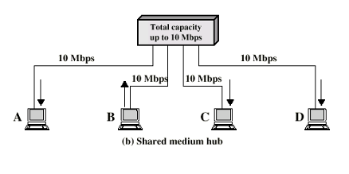

- One of the interconnection elements of [LAN](LAN.md)s
## Shared Medium Hubs
- **Function**: 
	- Act as a central connection point for devices in a LAN
- **Operation**: 
	- Broadcast incoming data packets to all connected devices
	- Only one station can transmit at a time
	- With a 10Mbps LAN
	- Total capacity = shared capacity
- **Type**: 
	- Operate at the [Physical Layer](Physical%20Layer.md)
	- Making no decisions about the data they forward
- **Limitation**: 
	- Can lead to network inefficiencies due to data collisions.

