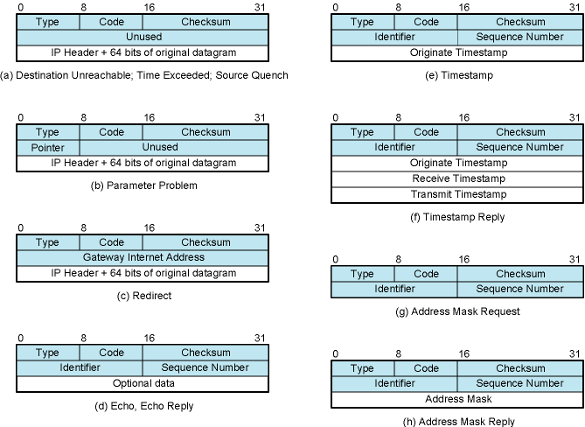

## Internet Control Message Protocol 

### Definition:
- RFC 792
- Sister protocol of [Internet Protocol (IP)](Internet%20Protocol%20(IP).md)
	- All IP implementations should also implement ICMP
	- Encapsulated in IP datagram
		- Thus not reliable
### Properties:
- Transfer of (control) messages from routers-to-hosts and hosts-to-hosts
- Feedback about problems
	- e.g. datagram discarded, router’s buffer full
- Some simple applications can be implemented using ICMP
	- e.g. ping, traceroute
