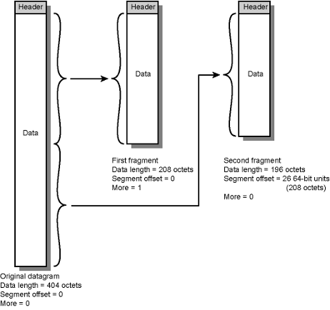

- One of the design issues of [IP](IP.md)
- Different maximum packet sizes for different networks
	- routers need to split datagrams smaller fragmentation
- Uses fields in header
	- Data Unit Identifier:
		- In order to uniquely identify datagram, all fragments that belong to a datagram share the same identifier
		- Part of IP Header:
			- Source and destination addresses
			- Upper protocol layer (e.g. TCP)
			- Identification supplied by that layer
	- Data length:
		- Length of user data in bytes (octets)  -> if fragment, length of fragment data
	- Offset:
		- Position of fragment of user data in original datagram
			- i.e. position of the first byte of the fragment
		- In multiples of 64 bits (8 bytes)
			- i.e. one unit of offset is 8 byte
	- More flag:
		- Indicates that this is not the last fragment or not
		- if flag = 1 -> mot last fragment
		- if flag = 0 -> last fragment
