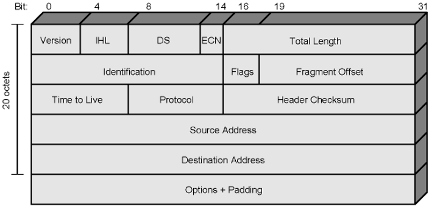
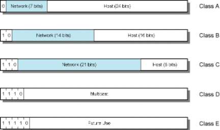

### Definition:  
- One of the types of [IP](IP.md)
- Uses a 32-bit addressing scheme. 
- Most commonly used IP version
- Used by [The Internet](The%20Internet.md)
- Will be replaced by [IPv6](IPv6.md) eventually 
- Specifies protocol format and mechanisms
### Packet Fields:
#### Header Field:
| Field                                                                   | Description                                                                                                |
| ----------------------------------------------------------------------- | ---------------------------------------------------------------------------------------------------------- |
| Version                                                                 | Currently 4                                                                                                |
| IHL (Internet Header Length)                                            | Unit is 32 bits (4 bytes), including options, minimum 5 (means 20 octets)                                  |
| DS (Differentiated Services) and ECN (Explicit Congestion Notification) | Previously used for Type of Service, now used by DS and ECN, DS is for QoS support, ECN concept seen later |
| Total Length                                                            | Of datagram (header + data), in octets (bytes)                                                             |
| Identification                                                          | Sequence number, used with addresses and Protocol to identify datagram uniquely                            |
| Flags                                                                   | More bit, Don't fragment                                                                                   |
| Fragmentation Offset                                                    | Position of fragment in original datagram, in octets (8-byte blocks)                                       |
| Time to Live                                                            | Specifies the time period that a datagram is allowed to remain active in the network                       |
| Protocol                                                                | Indicates the next higher layer protocol to receive the data field at the destination                      |
| Header Checksum                                                         | Verified and recomputed at each router                                                                     |
| Source Address                                                          | 32-bit IP address of the sender                                                                            |
| Destination Address                                                     | 32-bit IP address of the intended receiver                                                                 |
| Options                                                                 | Variable length, not always used                                                                           |
| Padding                                                                 | To fill to multiple of 32 bits long                                                                        |

#### Data Field:
- User (upper layer) data
- Any octet length is OK
	- Max length of IP datagram (header + data) = 65,535  bytes (octets)
### Address Formats:
- 32 bit global Internet address
- Network part and host part
- All-zero host part = the network
- All-one host part =  broadcast 
- 
- **Class A**:
	- Start with binary 0
	- 7-bit network - 24-bit host
		- Few networks - many hosts
	- All zero (network and host) -> "this computer"
	- 01111111 (127) (network part ) ->  loopback
		- go all the way down and come back on the home computer
		- Generally 127.0.0.1 is used
	- Range 1.x.x.x to 126.x.x.x
		- 10.x.x.x is for private networks
	- All networks have been allocated
- **Class B**:
	- Starts with binary 10
	- Range 128.x.x.x to 191.x.x.x
		- Second octet(first x) is also part of the network id
	- 14-bit network, 16-bit host number
		- $2^{14}$ = 16,384 class B addresses
		- $2^{16} - 2$ = 65,534 hosts per network
			- Minus 2 is due to network and broadcast addresses
	- All networks have been allocated
- **Class C**:
	- Start binary 110
	- Range 192.x.x.x to 223.x.x.x
	- Second (first x) and third (second x) octets are also part of network address
		- $2^{21}$ = 2,097,152 addresses (networks)
		- $2^{56} – 2$ = 254 hosts per network
		- Nearly all allocated
- **Classless Addresses**:
	- Extension of [Subnets and Subnet Masks](Subnets%20and%20Subnet%20Masks.md) idea to the whole Internet
	- Assigning IP numbers by partitioning network and host parts at any bit position
	- A precaution against exhaustion of IP addresses
	- Special notation (CIDR notation)
		- network address / number of 1-bits in the mask
		- e.g. 128.140.168.0/21
		- subnet mask is 255.255.248.0
		- Lowest host address = 128.140.168.1
		- Highest host address = 128.140.175.254
### Special IP Address Forms
| Prefix (network) | Suffix (host) | Type & Meaning |
|------------------|---------------|----------------|
| all zeros        | all zeros     | this computer (used during bootstrap) |
| network address  | all zeros     | identifies network |
| network address  | all ones      | broadcast on the specified network |
| all ones         | all ones      | broadcast on local network |
| 127              | any           | loopback (for testing purposes) |
