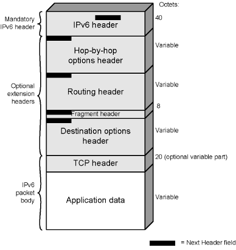
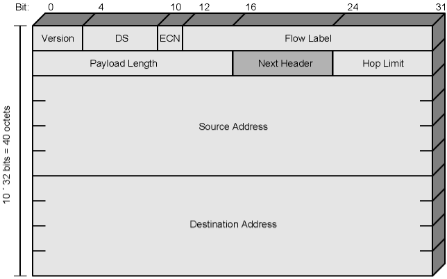
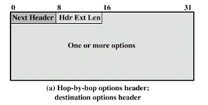
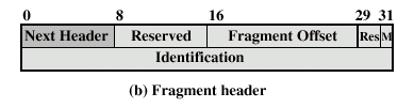
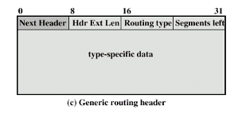

### Definition:
-  One of the types of [IP](IP.md)
- Uses a 128-bit addressing scheme. 
- Newer and offers more addresses.
- Not backward compatible with [IPv4](IPv4.md)
### Enhancements:
- Expanded address space -> 128 bit
- Improved option mechanism
	- Separate optional header between IPv6 header and transport layer PDU
	- Improved speed and simplified route processing since some options are not examined
	- Easier to extend with new options -> flexible protocol
- Support for resource allocation
	- Labeling of packets for particular traffic flow
		- "Flow label" field in the base header
	- Allows special handling -> e.g. real time video
### Packet Fields:
- IPv6 header + optional extension headers
 
#### IPv6 Header :
| Field | Description |
|-------|-------------|
| Version | 6 (binary: 0110) |
| DS/ECN | Previously Traffic Class (Types of Service) indicating packet priorities; now has a different interpretation |
| Flow Label | Identifies a sequence of packets (a flow) requiring special handling for QoS |
| Payload Length | Length of all extension headers plus user data |
| Next Header | Identifies the type of header following this one, whether an extension header or upper-layer protocol |
| Hop Limit | The number of hops remaining before the packet is discarded, similar to TTL in IPv4; decremented at each router |
| Source Address | The IP address of the sender |
| Destination Address | The IP address of the receiver |
- Longer header but less number of fields -> simplified processing
 
 - **Flow Label**:
	 - Designed to enable routers to recognize and quickly process packets belonging to the same flow without having to inspect the packet's payload
	 - facilitates efficient handling and routing
#### Extension Headers:
- **Hop-by-Hop Options Header:**
	- **Purpose:** Special options that require hop-by-hop processing
	 
	- Next header
	- Header extension length (unit: 8-bytes)
	- Options:
		- Type (8 bits), length (8 bits) , option data (variable size)
			- type also says what should router do if it does not recognize the option
		- Pad1 / Pad N -> Ensure header is multiple of 8 bytes
	- Jumbo payload (Jumbogram)
		- Option data field (32 bits) gives the actual length of packet in octets
			- excluding the base IPv6 header
		- if  $2^{16} -1$ < packet size < $2^{32}$ we use this option (large video packets)
	- Router alert
		- Tells the router that the content of packet is of interest to the router
		- Provides support for Resource Reservation Protocol (RSVP)
		- Backdoor!!! in the protocol, normally routers are do not look at the context
- **Fragment Header:**
	- **Purpose:** Fragmentation and reassembly information
		- Fragmentation is only allowed at source
		- No fragmentation at intermediate routers
		- Node must perform path discovery to find smallest MTU (max. transmission unit) 
			- iterative process
			- Source fragments must match with this MTU
			- Otherwise limit to 1280 bytes -> 1280 is min bytes supported by each network
	 
	- Next Header
	- Fragmentation offset -> same as [IPv4](IPv4.md)
	- More flag  -> same as [IPv4](IPv4.md)
	- Identification -> same as [IPv4](IPv4.md)
- **[Routing](Routing.md) Header:**
	- Similar to source routing
	- List of intermediate nodes to be visited
	- Base header contains the address of next router
	- Router examines the routing header and replaces the address in the base header before forwarding
		- Last address in Router Header = destination address
	 
	- Next Header
	- Header extension length
	- Routing type -> single type: type 0 routing (next 4 bytes not used)
	- Segments left -> number of nodes still to be visited
- **Destination Options Header:**
	- Optional info to be processed at destination node
	- Same format as Hop-by-Hop options header
- **Authentication Header** -> Integrity and Authentication
- **Encapsulating Security Payload (ESP) Packet** -> Privacy and Confidentiality (plus optional authentication)
### Addresses:
- 128 bits long
- Assigned to interface -> interface may have multiple addresses
- Network/host id parts
	- arbitrary boundary
	- like CIDR addresses in v4
- Multilevel hierarchy
	- Helps faster routing due to aggregation of IP addresses
		- Smaller routing tables and faster lookup
- IPv4 addresses are mapped into v6 addresses
- **Types:**
	- **Unicast**: 
		- an address that is assigned to a single interface
	- **Anycast**:
		- Set of computers (interfaces) that share a single address
		- Delivered to any one interface -> the “nearest”
	- **Multicast**:
		- One address for a set of interfaces/computers
		- Delivered to all interfaces/computers identified by that address
		- can be used to broadcast (but not specially designed for this)

>Transport and Tunnel Modes is it included ? ask