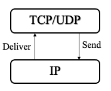

### Defintion:
- Responsible for addressing and routing packets to ensure they reach the correct destination.
- Connectionless 
- Best-effort delivery model
- Core of [TCP-IP Protocol](TCP-IP%20Protocol.md) suite
- Primary Protocol of [Network Layer](Network%20Layer.md)
- **Types:**
	- **[IPv4](IPv4.md)**
	- **[IPv6](IPv6.md)** 
- Why we change IPv4 with IPv6?
	- Address space exhaustion
		- Two level addressing (network and host) wastes space
		- Growth of networks and the Internet
		- Extended use of TCP/IP
### Differences between IPv4 and IPv6:
| Feature | IPv4 | IPv6 |
|---------|------|------|
| Header Length (IHL) | Present (Variable length header) | Not present (Fixed length header) |
| Main Header Length | Variable, due to IHL | Fixed length; extension headers counted in payload length |
| Protocol Information | Contains Protocol field | Uses Next Header field to eventually point to the transport layer protocol |
| Fragmentation Fields | Present in the base header | Fragmentation is handled by an extension header |
| Checksum | Contains header checksum | No checksum; relies on checks at other layers |
| Flow Label | In options part | Part of the base header |
### Properties:
- Each packet treated separately 
- Provide connectionless (datagram) service
	- Advantages:
		- Flexible and robust -> good when congestion occurred
		- No overhead for connection setup
		- can work with different network types
	- Disadvantages
		- Unreliable
		- Not guaranteed delivery
		- Not guaranteed order of delivery
			- Packets can take different routes
### Design Issues:
- **[Routing](Routing.md)**:
	- [Subnets and Subnet Masks](Subnets%20and%20Subnet%20Masks.md) provide necessary structure for routing traffic appropriately within and between networks.
	- End systems and routers maintain routing tables:
		- Indicate next router to which datagram should be sent
		- Routing Table Types:
			- Static Routing
			- Dynamic Routing
	- Routing Types:
		- Source routing
		- Route recording
- **Datagram Life**:
	- Datagram marked with lifetime
		- Time To Live (TTL) field in IP header mark lifetime of datagram
		- Once lifetime expires, datagram discarded (not forwarded)
		- Hop count
			- Decrement TTL by one as passing through each router
			- widely used
		- Time count
			- Need to know how long since last router
			- global clock is needed
- **Fragmentation and Re-assembly**:
	- Different maximum packet sizes for different networks
		- routers need to split datagrams smaller fragments
		- [IP Fragmentation](IP%20Fragmentation.md)
	- Reassembly is done at destination only in IP 
		- Reassembly may fail if some fragments get lost
		- Reassembly time out:
			- Assign a reassembly lifetime to the first fragment
			- If timer expires before all fragments arrive, discard partial data
- **Error Control**:
	- Delivery is not guaranteed
	- If packet discarded:
		- Router may attempt to inform source (failure message)
		- Specify the reason of drop, e.g. for time to live expiration, congestion, bad checksum (error detected)
		- Datagram identification needed, to understand which packet failed
	- When source receives failure notification
		- It may modify transmission strategy
		- It may inform high layer protocol
	- Failure notification is not guaranteed
- **Flow Control**:
	- Allows proceeding routers and/or stations to limit rate of incoming data
		- limited flow control since IP is connectionless
		- [ICMP](ICMP.md) provide some basic flow control capabilities = Source Quench packet
			- No fine tuning -> coarse-grained mechanism
			- Less affective compared to TCP flow control
- **Addressing**: Look the last figure in [TCP-IP Model](TCP-IP%20Model.md)
### IP Services
- Information and commands exchanged across adjacent layers
	- Primitives -> functions to be performed
		- Send -> Request transmission of data unit
		- Deliver -> Notify user of arrival of data unit
		- 
	- Parameters -> used to pass data and control info
		- Source IP address
		- Destination IP address
		- (upper layer) Protocol - > Recipient, e.g. TCP
		- Type of Service Indicators
			- Specify treatment of data unit during transmission through networks
			- Requests for service quality
			- Precedence -> 8 levels
			- Reliability -> Normal or high
			- Delay -> Normal or low 
			- Throughput -> Normal or high
		- Identification
			- Uniquely identifies PDU 
				- (source, destination IP addresses, user (recipient) protocol)
			- Needed for re-assembly and error reporting
		- Don’t fragment indicator
			- Prevents the fragmentation of a packet
			- If data is not fragmented and too bib -> may not be possible to deliver
		- Time to live (initial/last TTL value)
		- Data length
		- Options
			- Security -> security label - mostly for military applications
			- Source routing
			- Route recording
			- Stream identification ->identifies reserved resources for stream traffic (video)
			- Time stamping-> added by source and routers
		- Data from/to upper layer