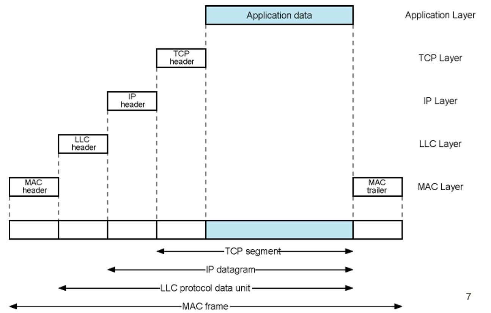

## Local Area Network (LAN)
### Definiton:
- LANs are network systems that span a relatively small area, typically a single building or campus.
	- Owned by some organization
	- Cabling and equipments belong to owner
	- No governmental line
- Shared Communication Medium + Regulations +Hardware/Software = LAN
- [Data Link Layer](Data%20Link%20Layer.md) in LANs corresponds to the lower two layers of the OSI model
	- With specific adaptations for Ethernet-based LANs
- Traditionally: Broadcast systems
    - Tendency to send messages to all devices on the network, regardless of the intended recipient
- Today most of the traditional LANs replaced with wireless LANs
### Properties:
- Smaller scope than WAN's
- Higher data transfer rates than WAN's
	- 10 Mbps t 100Gbps
- Low latency
- Limited size
- Requires setup and maintenance
### Protocol Architecture:
-  Based on [Ethernet](Ethernet.md) protocols, developed under the IEEE 802 Reference Model
	- [Logical Link Control (LLC)](Logical%20Link%20Control%20(LLC).md)
		- Manages protocol multiplexing, flow control, and error checking
	- [Medium Access Control (MAC)](Medium%20Access%20Control%20(MAC).md)
		- Prepares data for transmission
		- Performs error detection
		- Governs access to the transmission medium
	- [Physical Layer](Physical%20Layer.md)
		- Same properties with classic physical layer
	- 
- LAN Protocols
- 
### LAN Topologies:
- LANs can adopt various topologies, each with unique characteristics:
	- **[Bus Topology](Bus%20Topology.md)**: 
		- Devices are connected to a single central cable, or bus. 
	- **[Ring Topology](Ring%20Topology.md)**: 
		- Each device is connected to two others, forming a ring for data transmission.
	- **[Star Topology](Star%20Topology.md)**: 
		- All devices are connected to a central hub.
### Interconnection Elements:
- Used to connect devices and manage data flow in LANs
	- [Hubs](Hubs.md)
	- [Bridges](Bridges.md)
	- [Switches](Switches.md)
	- [Routers](Routers.md)
- Bridges vs. Switches:

| Feature | Bridge | Switch |
|---------|--------|----------------|
| **Frame Processing** | Analyzes and forwards one frame at a time | Has multiple parallel data paths and can handle multiple frames simultaneously |
| **Data Path** | Single data path | Multiple parallel data paths |
| **Operational Mode** | Store-and-forward operation | Supports both store-and-forward and cut-through operations |
| **OSI Layers Implemented** | Physical and MAC layers only | Physical, MAC, and LLC layers |
| **Commonality in Modern Networks** | Not common in new installations | Widely used in new installations with bridge functionality included |
| **Handling of Frames** | Limited by processing one frame at a time | Can process and forward multiple frames at once, increasing throughput |
| **Layer Functionality** | Limited Layer 2 functionality | Full Layer 2 functionality including advanced management and configuration features |
| **Usage** | Historically used when simple connectivity was required | Preferred for advanced network setups due to versatility and speed |
### Typical LAN Configuration
- Layer 2 Switch LANs are confined -> one message cannot go to other one

