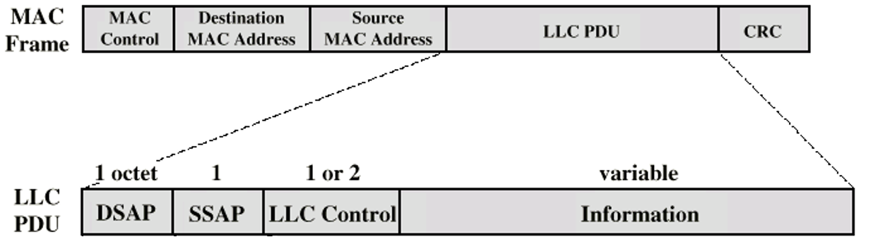

### Definition:
- A part of the IEEE 802 Reference Model in [LAN](LAN.md)s
- Operates as a sublayer within the [Data Link Layer](Data%20Link%20Layer.md)
- Provides an interface between the Network Layer and the [Media Access Control (MAC)](Media%20Access%20Control%20(MAC).md) sublayer
### Properties:
- Provides an interface to higher layers.
- Manages flow control.
- Based on classical Data Link Control Protocols.
- Manages protocol multiplexing, flow control, and error checking.

