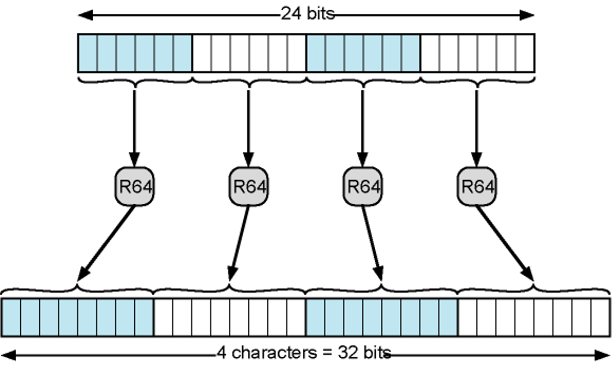

- Provide reliable delivery across various environments
- Used during [Electronic Mail](Electronic%20Mail.md) transmission process with [MIME](MIME.md) .
- Content- transfer-encoding field:
	- Header used to specify the method that should be used to convert the body of a message from its native format into a form that can be reliably sent across the network
- Encoding Types:
	- **7bit:**
		- No encoding 
		- Safe for STMP
	- **8bit:** no encoding
	- **Binary:** no encoding
	- **X-token:**
		- nonstandard encoding
		- application specific
	- **Quoted-printable:**
		- Useful if data is mostly constructed with ASCII characters
		- non-printable characters represented by hex code
	- **Base64:**
		- Encoding: 6 bit -> 8 bit mapping
		- Decoding: 8 bit -> 6 bit mapping
		- If the original message's bit length is not multiple of 6 -> pad with zeros to the end to make it multiple of 6
			- The message in ASCII code must be multiple of 4
			- \# of zeros / 2 =  \# of '=' needed to add ASCII type of encoded message 
		- 33.33% overhead -> increases to 4/3 of the original size
		- Example: 
		- 