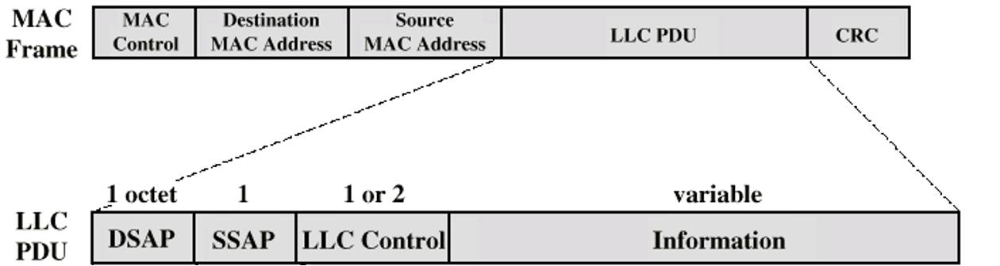

### Definition:
- Part of the [Data Link Layer](Data%20Link%20Layer.md) in the IEEE 802 model
	- Not found in traditional layer 2 data link control
- Provide orderly and efficient use of broadcast medium
### Properties:
- MAC layer receive data from [Logical Link Control (LLC)](Logical%20Link%20Control%20(LLC).md) layer
- Governs access to the shared transmission medium in [LAN](LAN.md)s
- Implements protocols like CSMA/CD in [Ethernet](Ethernet.md)
- Prepares data for transmission
- Responsible for error detection and address recognition
- Address recognition

### Channel Allocation:
- [Synchronous (static) Solutions](Synchronous%20(static)%20Solutions.md):
	- Everyone knows when to transmit
	- Two type:
		- Frequency Division Multiplexing (FDM)
		- Time Division Multiplexing (TDM)
- [Asynchronous (dynamic) Solutions](Asynchronous%20(dynamic)%20Solutions.md):
	- In response to immediate needs
	- Two type:
		- Round robin
		- Contention
