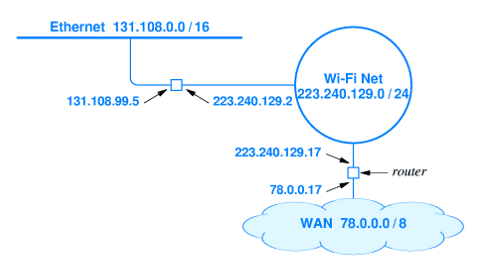

#NotFinished 
### Definition:
- Third layer in the [OSI Model](OSI%20Model.md) (Open Systems Interconnection) model.
- Primary protocol is [IP Protocol](TCP-IP%20Protocol.md)
	- common to all routers
- Facilitating data transmission between different networks.
- Responsible for logical IP addressing and routing, which determines the pathway for data packets across complex networks
- Example Network Configuration:
	- 
### Properties:
- **Routing and Forwarding**: 
	- Handles the routing of data by finding the best path for packet delivery through a network.
- **Logical Addressing**: 
	- Uses IP addresses to uniquely identify devices on a network
	- crucial for routing packets
- **Packet Handling**: 
	- Encapsulates data into IP packets
	- each with a header that includes source and destination information
- **Connectionless Communication**:
	- Often relies on a connectionless protocol like IP
	- allow each packet to be routed independently
- **Error Handling and Diagnostics**: 
	- Utilizes protocols like [ICMP](ICMP.md) for error reporting and network diagnostics
- **Fragmentation and Reassembly**: 
	- Manages the division of data into smaller packets for transmission and their reassembly at the destination.