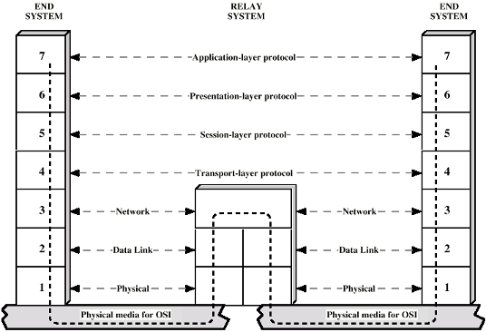

## Open System Interconnection (OSI) Model

### Definition:
- One of the [Protocols](Protocols.md) architecture
- A conceptual framework used to understand network interactions.
- Developed by the International Organization for Standardization.
### Properties
- **Utilization**: Not widely used; no surviving protocol uses the OSI model.
- **Structure**: Each layer relies on the one below it and provides services to the one above.
- **Modularity**: Changes in one layer do not require changes in other layers.
### Layers
1. **Physical Layer**: Manages physical medium, signaling, and connections.
2. **Data Link Layer**: Ensures error-free transmission between neighboring devices.
3. **Network Layer**: Manages data routing and packet forwarding.
4. **Transport Layer**: Ensures end-to-end data transfer and integrity.
	- SAP (Service Access Points)
		- unique identifier used to distinguish a particular communication endpoint in a networked device
5. **Session Layer**: Manages connections between applications.
6. **Presentation Layer**: Translates and ensures data formats and integrity.
7. **Application Layer**: Delivers services to users.

