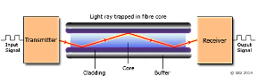

### Definition:
- One of the types of [Guided Media](Guided%20Media.md)
- Also known as Fiber Optic Cable
- Detailed information about [Optical Cable](https://www.geeksforgeeks.org/fiber-optics-and-types/?ref=lbp)

### Usage:
- Long distance communication lines
- Subscriber loops
- [LAN](LAN.md)s
### Properties:
- **Structure**:
	- **Core**: 
		- Thin fiber (8 - 100 micrometers) where light travels
		- Plastic or glass
	- **Cladding**:
		- Glass or plastic coating of fiber. 
		- Specially designed with a lower index of refraction. 
		- Acts as a reflector.
	- **Overcoat**: (Jacket/Buffer): 
		- Plastic layer to protect against environmental dangers
- Uses light for data transmission, which can be either laser or LEDs.
- Need [Right-of-Way](Right-of-Way.md) and cabling
- **Types**:
	- Single-mode (long-distance communication)
	- multi-mode (shorter distance, higher bandwidth).
### Pros & Cons:
- **Pros:** 
	- **High Bandwidth**:
		- Capable of transmitting large amounts of data at very high speeds
	- **Smaller size & weight**
		- easy installation
		- less physical space needed in ducts
	- **Low Signal Attenuation**
		- Signals in optical fiber degrade less over distance compared to copper cables
		- less repeaters/amplifiers needed
	- **Immunity to Electromagnetic Interference**:
		- Not vulnerable to EMI or RFI
	- **Security**
		- More secure against tapping and physically smaller for the amount of data they carry
- **Cons:** 
	- **Higher Initial Costs**
		- More expensive to install than copper networks
	- **Specialized Equipment Needed for Splicing and Repair**
		- Requires more delicate handling and specialized equipment
		- Require special transformers to adapt the common cable technologies
	- **Less Flexible**
		- Brittle and can be damaged if bent beyond a certain radius