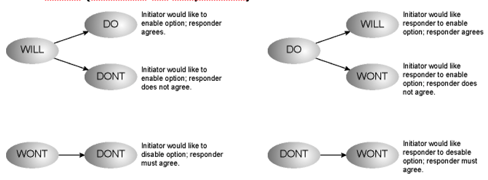

- The process where one party proposes a [Telnet](Telnet.md) option
	- The other party can either accept or reject.
- Options are not enabled until negotiation is complete.
- Four negotiation commands: **WILL, WONT, DO, DONT**
	- **WILL** -> Initiator would like to enable option
		- DO -> responder agrees
		- DONT -> responders do not agrees
	- **WONT** -> Initiator would like to disable option 
		- DONT -> responder must agree
	- **DO** -> Initiator would like responder to enable option
		- WILL -> responder agrees
		- WONT -> responders does not agree
	- **DONT** -> Initiator would like responder to diable option
		- WONT -> responder must agree
