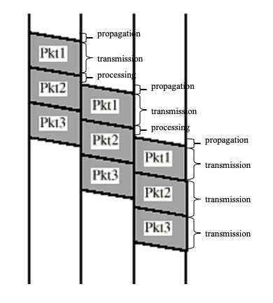

## Performance Metrics

### Throughput
- Effective capacity of the data bits 
	- reduced by protocol overhead (header + control header)
### Utilization
- The ratio of the time that channel is actually used for effective data bits
- Consider 
	- idle time in channel
	- propagation time
	- overheads
	- packet switching delays
### Delays in [Switching](Switching.md):
- Transmission time (delay)
	- Time taken to emit all bits into medium
	- Link Bandwidth (in bps) / Packet Size (in bits)
- Propagation time (delay)
	- Time for a bit to traverse the link
	-  The Length of Channel (Distance) / Propagation Speed
- Processing time (delay)
	- time spent at the recipient or intermediate node for processing
- Queuing time (delay)
	- waiting time at the queue to be sent out

