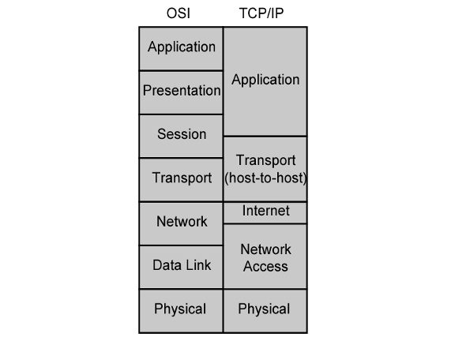
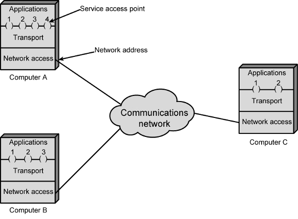

## Protocols
### Meaning:
- set of rules and conventions that devices must follow to communicate with each other
- Proper Communication: 
	- entities in different systems must speak the same language 
	- cooperative action is necessary
### Principles of Protocols:
- Each layer provides services to upper layer; expect services from lower one
- peer-to-peer protocols = each layer is independent
	- change in one protocol should not affect the other protocols
###  Architecture:
- There is a two different type of protocol architecture which is widely used
	- [TCP-IP Model](TCP-IP%20Model.md) Model
	- [OSI Model](OSI%20Model.md) Model
- OSI vs TCP/IP

### Addressing Requirements
- Two Level Addressing
	- Each Computer -> unique network address
	- Each Application -> unique address within the computer
				- SAP (OSI use this protocol)
				- Port (TCP/IP use this protocol)
	- 