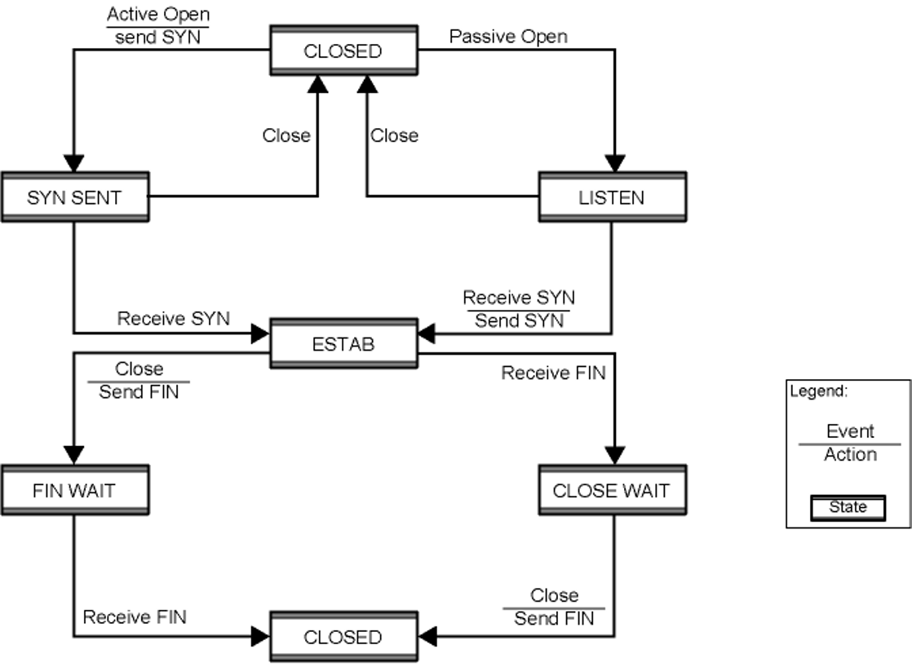

## Design Issues in Transport Layer
- One of the design issues cases in [Transport Layer](Transport%20Layer.md)
- case Assumption: Assume reliable Network Service
## Addressing and Multiplexing:
- Multiple application protocol uses one transport layer
	- Users are multiplexed
	- User id locally identified via port number
- User Identification -> host address & port -> socket
	- Port = particular transport service(TS)
	- Host address = attached network device
## Flow Control:
- End-to-end
- Receiver may not keep up with the flow of data -> "buffers filling up"
- Harder than Link-level flow control -> delay is bound tı network -> difficult to use timeout
- **Methods:**
	- **Do nothing:**
		- overflow -> discard segments (packets)
		- fail to get ACK -> retransmit
		- not good for reliability
	- **Backpressure:**
		- Refuse further segments at link or network layer ->propagate until to sender
		- Course grained approach since we cannot identify the problematic network
	- **Sliding Window + Credit scheme:**
		- similar to [Sliding Window](Sliding%20Window.md)
			- sender sends up to certain window size without getting ack
				- credits give the sender permission to send a certain amount of data, regardless of whether previous data has been acknowledged.
			- window size set dynamically (bytes)
		- Credit scheme prevents the sender from overloading the receiver's buffer
			- flow control is managed independently of the packet ack process
			- each segment has header like:
				- sequence number -> each byte has unique sequence number
				- ack number
				- window size 
			- segments are numbered with the sequence number of their first byte
## Connection Establishment/Termination:
- **Establishment (SYN)**
	- necessary even with reliable network services
	- mutual agreement -> control messages are exchanged
	- purpose:
		- allow each end user yo know the other exist and willing to communicate
		- negotiation of optional parameters
		- trigger allocation of transport entity resources
	- Two Scenarios:
		- Active/Passive Open: One side initiate the connection via sending SYN
		- Active/Active Open: Both side send SYN to initiate connection
	
- **Termination (FIN)**
	- Either side may initiate termination
	- Abrupt Termination
		- Data in transit may be lost
	- Graceful Termination
		- Mutual agreement
		- Connection is not closed until all data in transit delivered
	- **Side Initiating Termination:**
		- Transport layer user (upper layer) issues Close request
		- Transport entity sends FIN, requesting termination
		- Connection placed in FIN WAIT state
			- Continue to accept data
			- Do not send any more data
		- When FIN received, inform user and close connection
	- **Side Not Initiating Termination:**
		- When FIN received
			- Transport entity informs its user (upper layer)
			- place connection in CLOSE WAIT state
			- Continue to transmit data as received from its user (upper layer)
		- When the user of transport entity issues CLOSE primitive
			- Transport entity sends FIN
			- Connection closed
		- This procedure ensures that
			- both sides received all outstanding data
			- both sides agree to terminate
			- graceful termination
## Use of Header Fields:
- When sending -> sequence number (SN) of first byte in segment is included
- Two flow control related fields: 
	- AN = acknowledgment number -> AN=i
	- W = window size (for credit) -> W=j
	- All bytes with sequence numbers up to and including i-1 are acknowledged
		- Next expected byte is i
	- Permission to send window of W=j bytes (gives credit)
		- i.e. octets up to and including i+j-1
		- Not to be added to the remaining credit
		- Credit is not automatically refilled with ACK