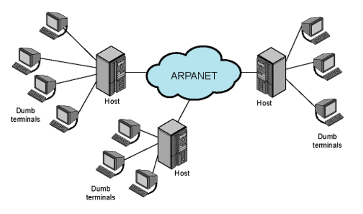

### Definition: 
- It refers to the capability to control and interact with a distant computer's command-line interface over a network.
- [Telnet](Telnet.md) is a protocol designed to provide this over [TCP/IP](TCP/IP) network.
- 
### Key Players:
- **Telnet Client**: 
	- Initiates the connection to access the remote machine.
- **Telnet Server**: 
	- Accepts and facilitates the connection on the remote machine.
- **Network Virtual Terminal ([NVT](NVT.md))**