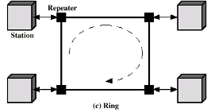
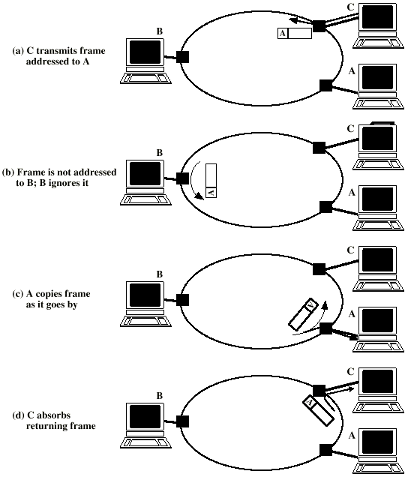

- A type of [LAN](LAN.md) Topology
- **Structure**:
	- Consists of repeaters joined by point-to-point links forming a closed loop.
	- The links are unidirectional -> data travels in one direction around the loop.
	  - Stations receive data on one link and retransmit it on the next
	  - Each station is connected to two repeaters
	  - 
- **Data Transmission**:
	- Data is transmitted in frames that sequentially pass all stations in the ring.
	- Destination station recognizes address and copies frame,
	- Frame circulates back to source station where it is removed
- **Frame Removal**:
	- After a frame completes its circuit and returns to the source station, it is removed from the ring.
- [Medium Access Control (MAC)](Medium%20Access%20Control%20(MAC).md) protocol is necessary to manage when and how stations can insert frames into the ring
- Full Frame Transmission Example:
