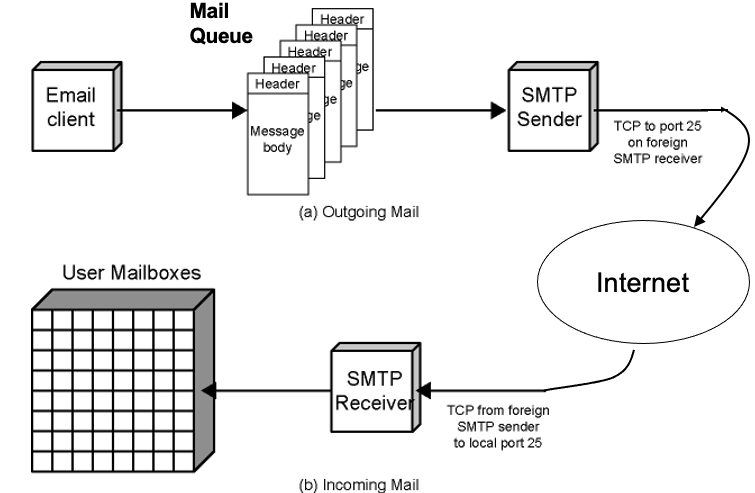

## Simple Mail Transfer Protocol (SMTP)
### Definition:
- A protocol used to transfer [Electronic Mail](Electronic%20Mail.md) between computers.
	- work between network to network
- It works at the [Application Layer](Application%20Layer.md) of the [OSI](OSI) model.
- Introduced with RFC 821
## Properties:
- Works on [TCP/IP](TCP/IP)
	- uses port 25
- Used for delivery of simple text messages
- Works in session manner
- Uses standard character set: 7 bit ASCII
- Not concerned with format of messages or data
	- SMTP uses the information in the email header to deliver the email
		- mail destinations derived from header
	- SMTP does not look at contents i.e. message body
- **Reliability:**
	- STMP generally considered as reliable
	- Since it uses TCP, the connection is reliable
	- Bad sides:
		- No end-to-end acknowledgement to originator (sender)
			- If not delivered, an error message comes back to the originator
		- No guarantee to recover lost messages
		- Legitimate email may be go to spam or trash
- **Scope:**  Limited to conservation between sender and receiver
- **Replies:**
	- Positive completion reply (2xx)
	- Positive intermediate reply (3xx)
	- Transient negative completion reply (4xx)
	- Permanent negative completion reply (5xx)
- STMP service Extension: [ESMTP](ESMTP.md) --> [MIME](MIME.md)
### SMTP Mail Flow

### SMTP Sender:
- **Role**: Manages outgoing email messages.
- **Queue Management**: Retrieves email messages queued for sending.
- **Transmission**:
	- Sends the email to the destination host.
	- Uses a sequence of SMTP commands for the transmission.
	- Establishes a TCP connection by using port 25, to transmit the email.
	- •If the client does not run a mail sender:
		- SMTP  asks a server to do so
			- Client acts as a sender
			- Server acts as a relay ([Relaying](Relaying.md))
- **Post-Delivery**:
	- Once the email is delivered
		- sender removes the recipient's address from the message's recipient list.
	- If the email has been sent to all intended recipients
		- message is deleted from the sender's queue.
	- **Optimization**:
	- If we send email to multiple recipients on the sam host
		- message body is sent only once over a single SMTP connection
		- increase the efficiency
### SMTP Receiver:
- **Role**: Manages incoming email messages.
- **Reception**:
	- Accepts the incoming email message from the sender.
	- Stores the message in the user's mailbox or places it in an outgoing queue for further forwarding or processing.
- **Confirmation**:
	- Sender responsible for message until receiver confirms complete transfer
		- i.e. mail has arrived at host, not user has received the message
### Phases of Operation:
- **Connection Setup:**
	- Sender opens TCP connection with receiver
		- Connects port 25 of the receiver
	- Receiver identifies itself
		- Mail service  available
			- 220 < domain > service ready
		- Mail service not available
			- 421 service not available
	- Sender identifies itself
		- HELO < domain >
	- Receiver accepts sender's identification
		- 250 OK
- **Mail Transfer:** 
	- RFC 822 -> format for text messages
	- Sender may send one or more messages to receiver
	- MAIL FROM: 
		- Command identifies originator
		- Receiver returns 250 OK or appropriate fail/error message
	- RCPT TO: 
		- Can be one or more
		- Commands identifies recipients for the message
		- Separate reply for each recipient: accept, reject, etc.
	- DATA 
		- Command transfers message text
		- End of message indicated by line containing just period (.)
- **Connection termination**
### Possible Errors:
- There can be two type of errors during email transmission
	- Transient Problems
		- STMP server may be unreachable
		- TCP connection may fail
	- In this cases, sender re-queues mail
		- give up after period of time
- If destination address is corrupted or faulty
	- Delivery failed immediately
	- Bounces back to sender