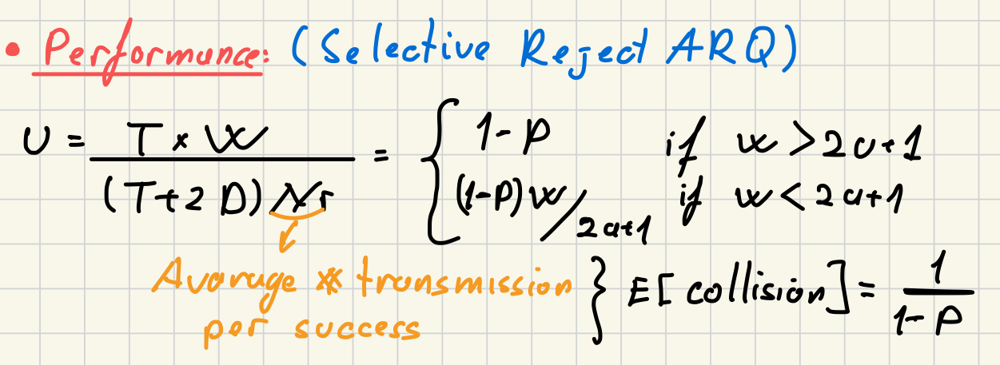
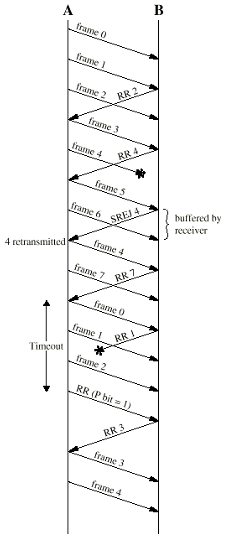

### Definition:
- A type of ARQ used in [Data Link Control Layer](Data%20Link%20Control%20Layer.md) for error control.
- Based on [Sliding Window](Sliding%20Window.md)
- Also called selective retransmission ARQ
- For sender and receiver window size = buffer size -> $2^{n-1} \text{ or } 2^n/2$
### Operation:
- Only rejected frames are retransmitted
- Subsequent frames are accepted by the receiver and buffered
- Minimizes retransmissions
- Receiver must maintain large enough buffer
- Complex implementation
### Performance:

### Example:
- k= 3 i.i.e frame numbering is in module 8
- last RR is the ACK request
