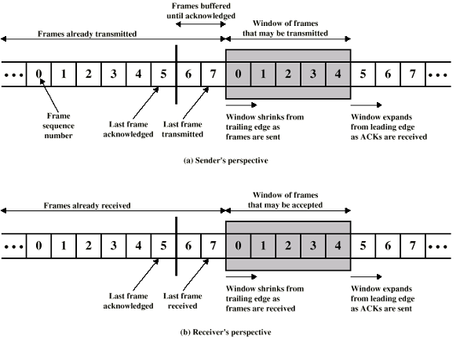
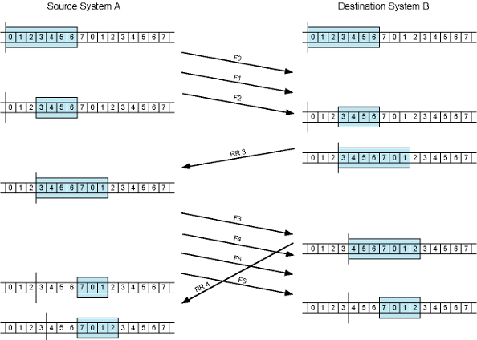
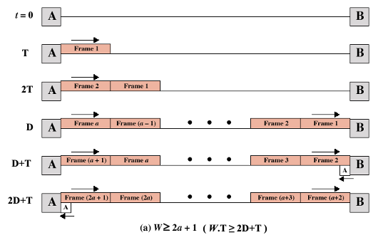
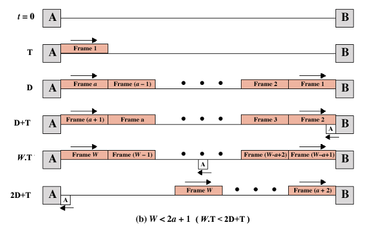

#NotFinished  
### Definition:
- A type of Flow Control Method in [Data Link Control Layer](Data%20Link%20Control%20Layer.md)
- Can send multiple packets (difference from Stop and Wait)
- When W = 1 Window slide becomes a[Stop and Wait](Stop%20and%20Wait.md) 
### Error Free Version:
- **Operation**:
	- Receiver has buffer of W (called window size) frames
	- Transmitter can send up to W  frames without ACK
	- Each frame is numbered
	- Sequence number bounded by size of the sequence number field (k bits)
	- thus frames are numbered modulo 2k (0 … 2k-1)
	- ACK includes number of next frame expected
	
	
- **Enhancement to implementation**:
	- Receiver can acknowledge frames without permitting further transmission (Receive Not Ready)
		- Must send a normal acknowledgement to resume
	- If the link is duplex, use piggybacking
		- Send data and ack together in one frame -> frame has both data and ack fields
	- If no data to send, use acknowledgement frame without data
	- If there is data but no new acknowledgement to send, send last acknowledgement number again
- **Performance:**
	- Total time = 2D+T = 2a+1
	- where a= D/T
	- W > 2a+1 = 2D+T -> Utilisation = %100
	- W < 2a+1 = 2D+T -> Utilization = W/2a+1 = TxW /2D+T

