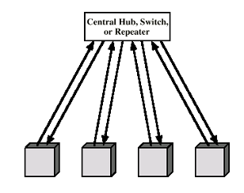

- A type of [LAN](LAN.md) Topology
- **Structure**:
	- Each station is directly connected to a central node
	- Uses full-duplex (bi-directional) links 
		- two-way communication between the central node and stations
- **Central Node Functions**:
	- **Broadcasting**: 
		- Acts as a hub, capable of broadcasting signals to all connected stations.
	- **Switching**: 
		- When functioning as a switch, it intelligently retransmits incoming frames only to the intended destination station
		- preventing collisions
- **Topology Logic**: 
	- Physical star, but logically like bus due to broadcast medium
- **Transmission Rules**:
	- Only one station can successfully transmit at a time to prevent collisions at the hub.
- Today's networks typically use this topology with switching technology for efficient data routing without collisions.
