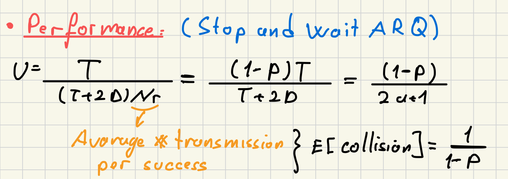
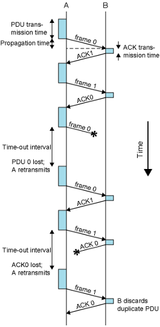

### Definition:
- A type of ARQ used in [Data Link Control Layer](Data%20Link%20Control%20Layer.md) for error control.
- Based on [Stop and Wait](Stop%20and%20Wait.md)
### Operation:
- Source transmit single frame
- Then wait for ACK
	- If ACK is not received within a certain timeout period
		- transmitter assumes the frame was lost or ACK was damaged
			- damaged/duplicate frames are discarded by the receiver.
		- retransmits the frame
	- If ACK is received and it is not damaged
		- transmitter proceeds to send the next frame
- ACKi means “I am ready to receive frame i”
### Performance:

### Efficiency:
- Simple
- Inefficient ->   in unreliable or high-latency networks
	- due to the waiting time between frame transmissions
