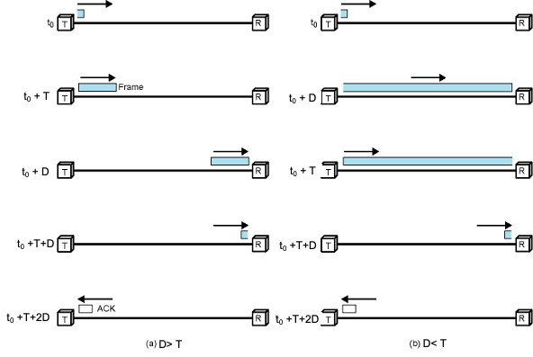

#NotFinished 
### Definition:
- A type of Flow Control Method in [Data Link Control Layer](Data%20Link%20Control%20Layer.md)
- Cant send multiple packets
### Error Free Version:
- **Operation**:
	- Source transmits frame
	- Destination receives frame and replies with acknowledgement (ACK)
	- Source waits for ACK before sending next frame
	- Destination can stop flow by not sending ACK
- **Fragmentation**:
	- generally large block of data split into small frames
	- Advantages
	- Limited buffer size at receiver
	- Errors detected sooner (when whole frame received)
	- On error, retransmission of smaller frames is needed
	- Prevents one station occupying medium for long periods
- **Performance:**
	- Works well for large frames
	- Inefficient for smaller frames
	- Total time = 2D+T = 2a+1
	- where a= D/T
	- Channel Utilization is higher when
		- Ttrans(T) > Tprop(D) = frame length(L) > bit length of the link (DxR)
		- Utilization = T/T+2D = 1/1+2a where a = D/T and T = L/R
		- R means capacity

