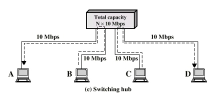

- One of the interconnection elements of [LAN](LAN.md)s
- **Function**: 
	- Network devices that connect various components within a LAN.
- **Operation**: 
	- Operate at the [Data Link Control Layer](Data%20Link%20Control%20Layer.md) (Layer2)
	- Central repeater acts as switch
	- Send Incoming frame switches -> appropriate outgoing line
		- Other lines can be used to switch other traffic
		- More than one station transmitting at a time
		- Each device capacity = LAN capacity
		- Total Capacity = N x10 Mbps
	- Forwarding data based on [Medium Access Control (MAC)](Medium%20Access%20Control%20(MAC).md) & [Logical Link Control (LLC)](Logical%20Link%20Control%20(LLC).md) addresses

- **Types:**
	- **Store and Forward:**
		- Accept input -> buffer it briefly -> then output
	- **Cut Trough:**
		- Begin repeating incoming frame onto output line as soon as address recognized
			- Possible since destination address is at the beginning of frame
			- May propagate some bad frames
				- Because CRC (FCS) control bits are at the end of the frame and all frame is needed to verify CRC (FCS)
- **Performance**: 
	- Reduce collisions by providing a dedicated path to each connected device
	- Number of LANs increase -> Broadcast overload or overhead
- **Advantages**: 
	- Offer better performance and security compared to hubs
- **Problems and Possible  Solutions:**

| Limitation | Explanation | Impact | Solution |
|------------|-------------|--------|----------|
| **Broadcast Overload** | Protocols like ARP broadcast frames across the entire LAN. | Leads to unnecessary data processing on all devices, creating network congestion. | Use routers to segment the network into subnetworks, limiting the broadcast domain. |
| **Lack of Multiple Routes** | Common MAC broadcast address means broadcasts reach all devices on the network. | Increased overhead and potential for broadcast storms that can degrade network performance. | Introduce IP-based routers which can manage multiple routes and employ advanced routing algorithms. |
| **No Loops in LAN** | The nature of Layer 2 networks doesn't allow for loops due to the absence of advanced routing logic. | Limits redundancy and failover options, affecting network reliability and performance. | Employ routers to create a hierarchical network structure with multiple paths for data packets, enhancing reliability and redundancy. |
| **Single Route Limitation** | Only one route is typically allowed between any two devices in a Layer 2 network. | Restricts network design and can lead to single points of failure. | Routers enable the use of multiple routes, increasing the robustness and efficiency of the network infrastructure. |
