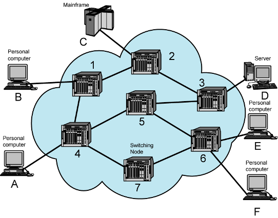
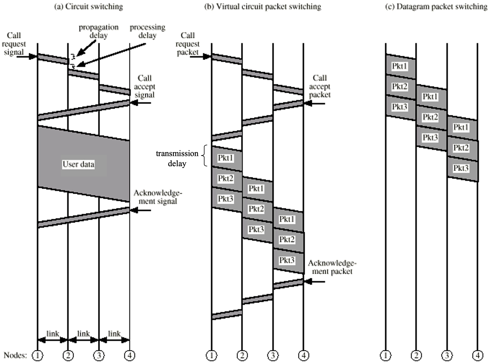

### Definition:
- In the wide area networks (WANs), data are switched from one node to another towards the destination
- These nodes (switching nodes) are not interested in the data
	- if switching nodes are failed ->  path change via [Routing](Routing.md)
- Main purpose of Nodes: relaying the data from one node to another until it reaches to destination

### Types Of Switching
- There are two types of switching method in WANs
	- [Circuit Switching](Circuit%20Switching.md)
	- [Packet Switching](Packet%20Switching.md)

