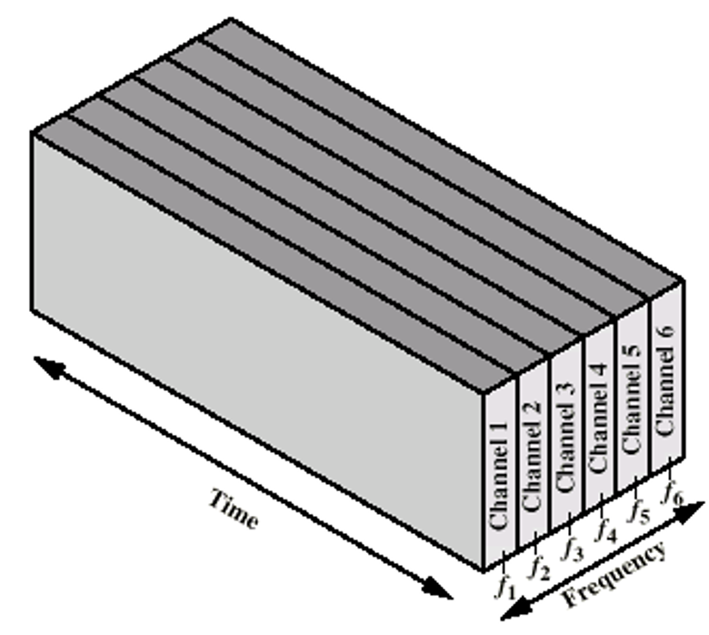
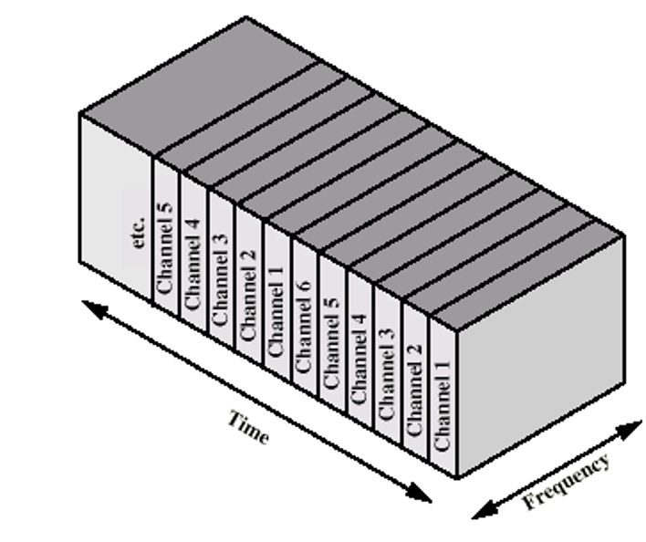

### Defintion:
- A way of solving synchronization in channel allocation problem in [Medium Access Control (MAC)](Medium%20Access%20Control%20(MAC).md) sublayer.
- Idea: Everyone knows when to transmit 
- These solution ensure 
	- efficiently managing network resources
	- multiple data streams can coexist over a single transmission medium without interference
### Types:
### Frequency Division Multiplexing (FDM)
- **Definition**: 
	- Channel is divided to carry different signals at different frequencies
	- One channel per user
	
- **Properties**:
	- Allows multiple users to send data simultaneously, each over a separate frequency band.
	- Efficient -> if # user =  # channel with continuous traffic
		- even here there is a low utilization since:
			- Network traffic is not uniform
			- Some users may not have something to send all the time (idle channel)
	- Problematic -> if # user < # channel or # user > # channel with bursty traffic
		- Low Utilization
		- Not used channels became idle and reduce utilization
- **Applications**:
	- Radio and TV broadcasting

### Time Division Multiplexing (TDM)
- **Definition**: 
	- Divide the time into several slots
	- Each user is statically allocated one time slot
	
- **Properties**:
	- Users transmit in turn, each using the entire bandwidth for a fixed time slot
		- if a particular user does not have anything to send
		- it remains idle and wastes the channel for that period
	- User may not utilize the whole channel for a time slot
	- Requires precise timing 
	- Inefficient
- **Applications**:
	- Common in digital telecommunications, especially where the transmission medium’s capacity is higher than the data rate of digital signals.