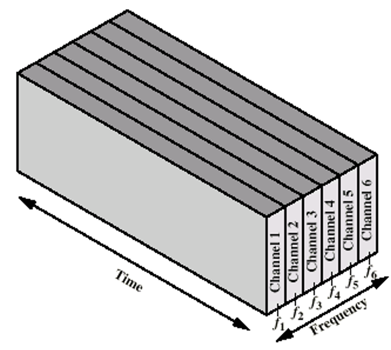

### Defintion:
- A way of solving synchronization in channel allocation problem in [Media Access Control (MAC)](Media%20Access%20Control%20(MAC).md) sublayer.
- These solution ensure 
	- efficiently managing network resources
	- multiple data streams can coexist over a single transmission medium without interference
### Types:
### Frequency Division Multiplexing (FDM)
- **Definition**: 
	- Channel is divided to carry different signals at different frequencies
	- One channel per user
	
- **Properties**:
	- Allows multiple users to send data simultaneously, each over a separate frequency band.
	- Efficient -> if # user =  # channel with continuous traffic
		- even here there is a low utilization since:
			- Network traffic is not uniform
			- Some users may not have something to send all the time (idle channel)
	- Problematic -> if # user < # channel or # user > # channel with bursty traffic
		- Low Utilization
		- Not used channels became idle and reduce utilization
- **Applications**:
	- Radio and TV broadcasting

### Time Division Multiplexing (TDM)
- **Definition**: 
	- divide the time into several slots
	- Each user is statically allocated one time slot
- **Properties**:
	- **Sequential Transmission**: Users transmit in turn, each using the entire bandwidth for a fixed time slot.
	- **Synchronization**: Requires precise timing to ensure each user transmits during their allocated slot.
- **Applications**:
	- Common in digital telecommunications, especially where the transmission medium’s capacity is higher than the data rate of digital signals.
- **Pros and Cons**:
	- **Pros**: Ensures a dedicated time slot for each user, providing predictable transmission times.
	- **Cons**: Can be inefficient if a user has no data to transmit in their allocated slot, leading to underutilization of the channel.
•

—if a particular user does not have anything to send, it remains idle and wastes the channel for that period

—A user may not utilize the whole channel for a time slot

Thus, inefficient.