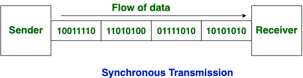

### Definition:
- One of the solution to synchronization problem in [Physical Layer](Physical%20Layer.md)
- Synchronous transmission is more efficient for continuous data streams, requiring a common clock signal for synchronization

### Properties:
- **Data Transmission**: 
	- Involves sending a block of data without start or stop bits
	- no overhead (except error correction bits)
- **Clock Signal**: Uses a common clock signal.
	- The clock starts → data transmission starts
	- The clock stops → data transmission stops
	- Clock signal is generated by the sender
	- Data is sampled once per clock cycle
- No further synchronization needed for short distances and point-to-point communication.
- Errors are detected and corrected in real time
- Low latency due to real-time communication
	- Fast
### Usage:
- Effective for continuous, high-speed data transfer where maintaining a constant connection is feasible
	- Chat Rooms
	- Telephonic Conversations
	- Video Conferencing