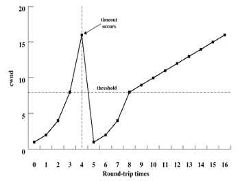
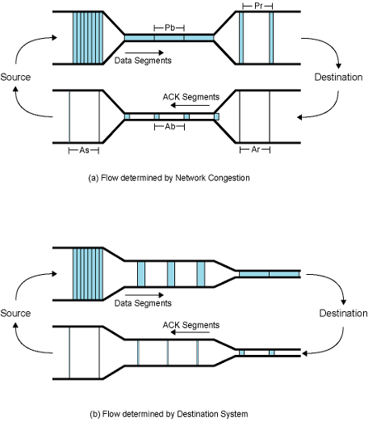
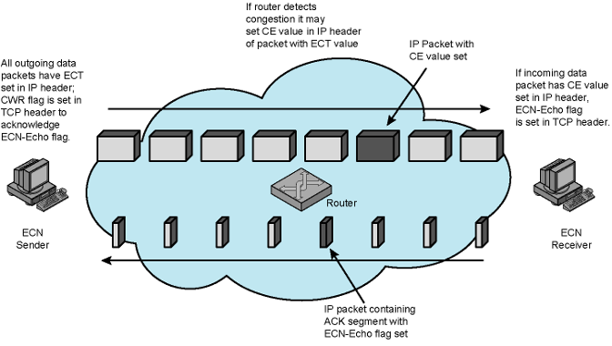

- One of the properties of the [TCP](TCP.md)
### Retransmission Strategy
- TCP relies on positive acknowledgements
	- Retransmission on timeout
- Timer associated with each segment starts as soon as it is sent
- If timer expires before acknowledgement is received, sender must retransmit
- Value of retransmission timer is a key factor
	- Too small -> unnecessary retransmissions -> wasting network bandwidth
	- Too large -> delay in handling lost segments
- Timer should be longer than round-trip delay -> delay is variable
	- Fixed timer -> Unable to respond changing network conditions
	- Adaptive timer -> Timer value changes as network conditions change
		- TCP uses adaptive timer
### Adaptive Timer: 
- **Definition:**
	- Timer value changes as network conditions change
	- TCP uses adaptive timer
- **Problem:**
	- Difficulty in calculating the round-trip time and timeout value
	- 2 sub-problems
		- Estimate the next RTT by observing pattern of delay
			-  Using Simple Average
				- average of the observed RTTs over a number of segments
				- not good solution
			- Using Exponential average
				- later segments have more weight
				- better solution but it has problems
		- Determine the timeout value by setting a bit greater than this estimate
			- Retransmission TimeOut (RTO) = Retransmission Timer
			- Add fixed $\Delta$ to estimated RTT
				- $RTO(K+1) = SRTT(K+1) + \Delta$
			- Multiply estimated SRTT with a fixed factor > 1
			- Both of them not good approach
	- No perfect solution exists ->standard heuristic 
- **Heuristic Solutions:**
	- **Exponential Averaging:**
		- Smoothed Round-Trip Time (SRTT)  -> Estimated one
		- RTT is the observed one 
			- measured time between sending a segment and receiving its ack
		- $SRTT(K+1) = \alpha \times SRTT(K)+(1–\alpha)\times RTT(K+1)$
			- SRTT(K+1) is estimate for (K+2)nd round-trip time
			- SRTT(0)= 0
		- Gives greater weight to more recent values as shown by expansion of above:
			- $SRTT(K+1) = (1–\alpha)RTT(K+1) + \alpha(1–\alpha)RTT(K) +  \alpha^2(1–\alpha)RTT(K–1) + \dots + \alpha K(1–\alpha)RTT(1)$
			- $\alpha$ and $1–\alpha$ < 1 -> successive terms get smaller
			- Smaller values of $\alpha$ -> greater weight to recent RTT values
	- **Determining the RTO:**
		- better estimation:
			- If the RTO depends = the estimated SRTT  + standard deviation in SRTT
			- [Jacobson’s Algorithm](Jacobson’s%20Algorithm.md)
### TCP Window Management
- **Problem Definition:**
	- TCP give some credits to send segments (called the window)
	- But this mechanism itself is not sufficient for a proper congestion avoidance and control
- **Solution Mechanisms:**
	- **Slow Start:**
		- Starting with large window -> not good since we do not know network situation
		- Start connection with a small window -> called congestion window (cwnd )
			-  cwnd = “allowed current credit”
		- initially one segment only
		- Enlarge congestion window at each ACK
		- Add one segment to congestion window for each ack received
		- Up to available credit = full window size
		- Congestion window growth is exponential
	- **Dynamic Window Sizing on Congestion:**
		- When a timeout occurs
		- Run slow start until the threshold
		- threshold = half of the current congestion window at which timeout occurred.
		- Increasing cwnd size by 1 segment for every ACK
		- After threshold, increase congestion window by one segment for each RTT
			- linear increase in window size
		- 
	- **Fast Retransmit:**
		- RTO > RTT
		- If a segment is lost, TCP may be slow to retransmit
		- TCP rule: 
			- if a segment is received out of order -> ack must be issued immediately for the last in-order segment
			- TCP receiver continues to send the same ACK for each incoming segment until the missing one arrives
			- After that, all incoming segments are ACKed.
		- Fast Retransmit rule: 
			- if 4 acks received for same segment -> highly likely it was lost -> retransmit immediately (rather than waiting for timeout)
	- **Fast Recovery:**
		- When TCP retransmits a segment using Fast Retransmit, a segment was assumed lost
		- Congestion avoidance measures are appropriate at this point
		- This may be unnecessarily conservative since multiple acks indicate segments are getting through
		- Fast Recovery rule:
			- retransmit lost segment
			- cut cwnd in half
			- proceed with incrementing the congestion window size by adding 1 segment for each ACK received
		- This avoids initial exponential slow-start
### TCP Congestion Control:
- Detailed information for general topic can be seen in here: [Congestion Control](401/CS408/Congestion%20Control.md)
- **Definition:**
	- Dynamic routing can reduce congestion by spreading load more evenly
	- But only effective for congestion due to unbalanced loads and brief surges in traffic
	- Congestion can ultimately be controlled by limiting total amount of data entering network
- **Implicit Congestion Control:**
	- The rate at which a TCP entity can transmit is determined by rate of incoming ACKs to previous segments with new credit
	- Rate of ACK/credit arrival determined by the bottleneck in the round-trip path between source and destination
		- Bottleneck may be destination or Internet
	- Steady state: 
		- sender’s segment rate is equal to the slowest line on the round trip path
	- TCP’s self-clocking behavior
		- TCP automatically senses the network bottleneck
		- However cannot say whether the bottleneck is at destination or at network
	
- **Explicit Congestion Notification (ECN):**
	- not native in [TCP-IP Protocol](401/CS408/TCP-IP%20Protocol.md)
	- Routers alert end systems about growing congestion
	- End systems take precautions to reduce load
	- ECN prevents packet drops
	- Alert end systems before congestion causes packet drop
		- Retransmissions are avoided
	- Changes done to use ECN
		- Two new bits are added to TCP header
			- ECN-Echo (ECE) flag
				- Used by receiver to inform sender when CE packet has been received
			- Congestion Window Reduced (CWR) flag
				- Used by sender to inform receiver that sender's congestion window has been reduced
			- These two bits are also used in connection establishment to enable end points to agree to use ECN
				- A sends SYN segment to B with ECE and CWR set (both 1)
					- A is ECN-capable and prepared to use ECN as both sender and receiver
				- If B is prepared to use ECN
					- returns SYN-ACK segment with ECE set CWR not set 
					- (ECE: 1, CWR: 0)
				- If B is not prepared to use ECN
					- returns SYN-ACK segment with ECE and CWR not set
					- (ECE: 0, CWR: 0)
		- Two new bits are added to IP header
			- Originally
				- IPv4 header includes 8-bit Type of Service field
				- IPv6 header includes 8-bit Traffic Class field
			- These fields are not used since they are not needed
			- Later this field is reallocated
				- Leftmost 6 bits dedicated to DS (differentiated services) field,
				- Rightmost 2 bits was unused
			- RFC 3260 renames these unused bits as ECN field

| Value | Label   | Meaning                 | 
| ----- | ------- | ----------------------- |
| 00    | Not-ECT | Packet is not using ECN |
| 01    | ECT(1)  | ECN-capable transport   |
| 10    | ECT(0)  | ECN-capable transport   |
| 11    | CE      | Congestion experienced  |
### Basic ECN Oparation:
